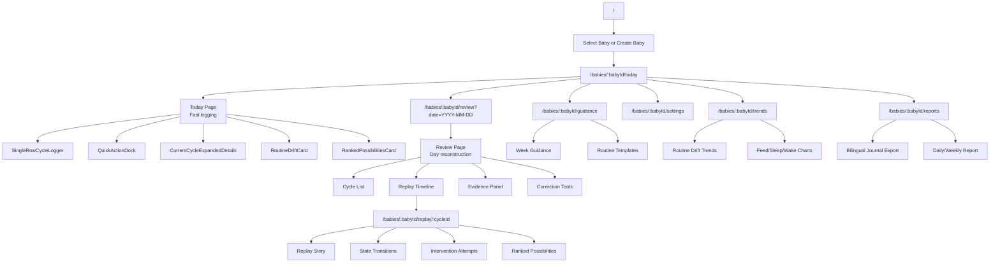
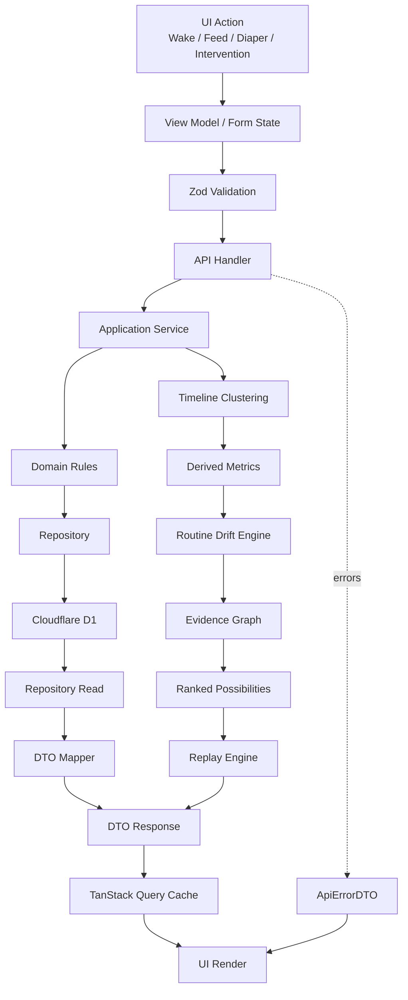
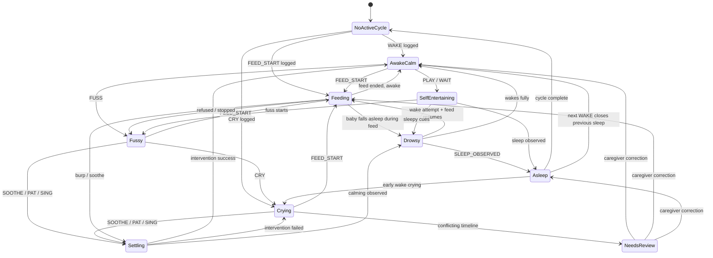
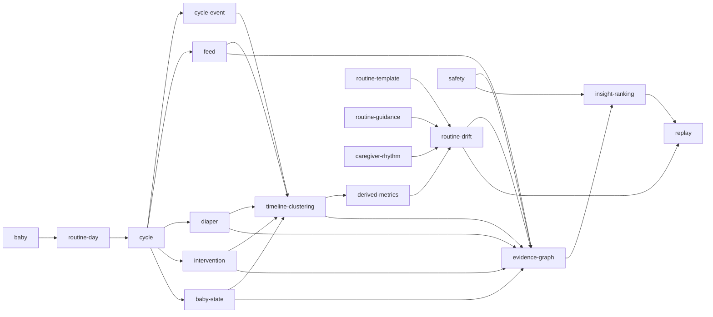
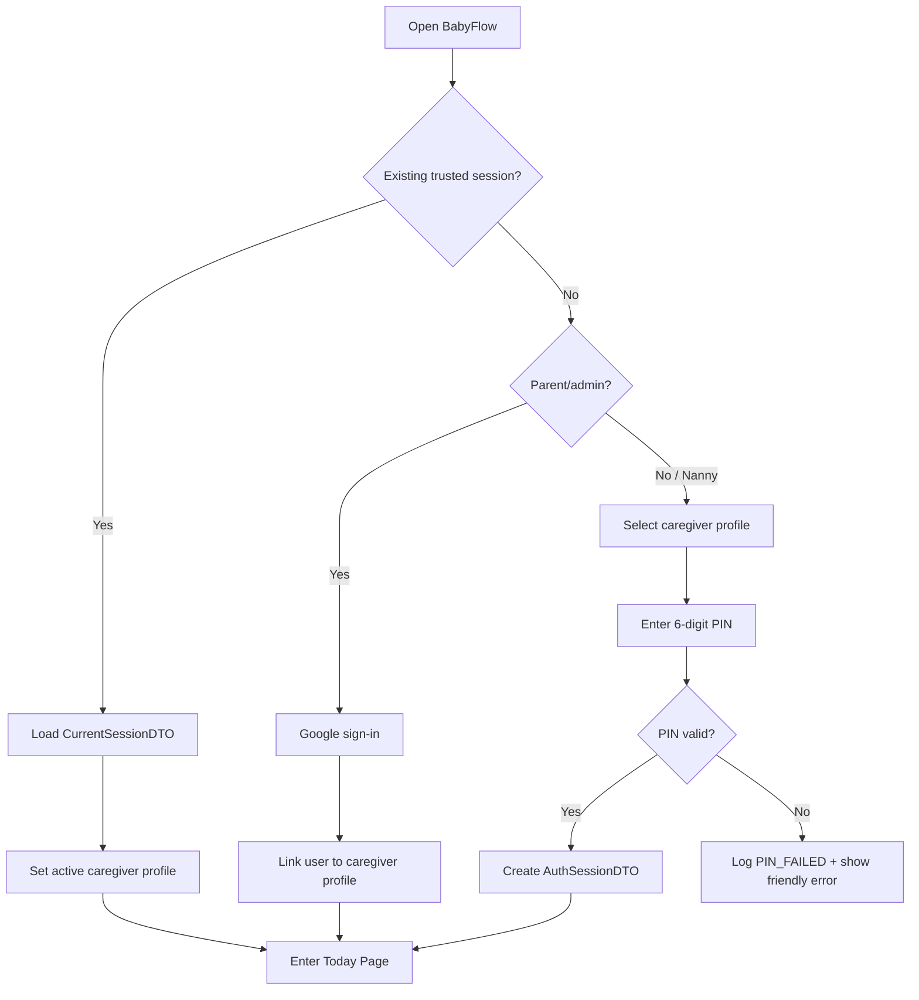
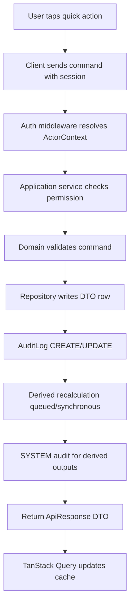
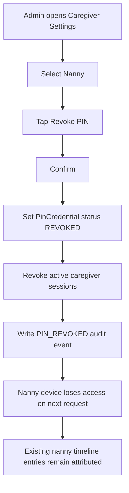

# BabyFlow — Canonical Master Spec v8a

**Status:** Canonical architecture spec after v2 merge + v3 critique audit + v5 UI/implementation expansion + v6 auth/caregiver access layer + v6b dynamic rolling recalculation engine + v7 benchmark/settings architecture + v8 paper-journal parity view correction + v8a real timeline stream and correction/update/delete flows  
**Purpose:** Replace the earlier tracker-oriented wording with one coherent product doctrine: a fast timeline journal that powers caregiver decision support.

---

# 0. Executive Summary

This app must not become a generic baby tracker.

The strongest version is:

```text
A low-friction baby routine timeline that captures real-life events,
clusters them into recovery-regulation episodes,
and turns them into evidence-based, confidence-scored decision support
for caregivers.
```

The timeline remains the foundation.

In v8, the visible product surface must also clearly match the physical paper journal. The app must support a real Paper Journal View so the paper and app can be used together, compared side-by-side, and validated against the same row/column model.

In v8a, the Timeline View must become a real chronological event stream. The Current Cycle Summary is useful, but it is not the timeline. Timeline View must show both: a row summary and a visible ordered event feed. v8a also adds first-class correction, update, undo, merge, and soft-delete flows because tired caregivers will make logging mistakes.

The decision-support system is the point.

That means the app has two inseparable layers:

```text
1. Timeline Layer
   Fast, one-row, paper-journal-style logging of what happened.

2. Interpretation Layer
   Evidence graph, state transitions, intervention attempts, routine drift,
   ranked possibilities, replay, and caregiver guidance.
```

Do not choose between them.

The product works only when the timeline is strong enough to support the decision system, and the decision system is restrained enough to preserve uncertainty.

---

# 1. Canonical Product Philosophy

## 1.1 Rewritten Core Principle

Earlier principle:

```text
Parents log what happened.
The app derives what it means.
```

This remains directionally correct, but it is too narrow.

Canonical principle:

```text
Caregivers log observations, events, interventions, and uncertainty.
The app reconstructs the routine timeline, clusters the episode,
compares it against age-appropriate expectations,
and presents ranked possibilities with evidence and confidence.
```

## 1.2 Product Doctrine

The app must support:

- messy real-life baby routines
- fast logging at 2am
- incomplete information
- caregiver uncertainty
- interrupted feeds
- failed soothing attempts
- state changes such as calm → fussy → crying → feeding → asleep
- routine drift from expected developmental rhythm
- week-based guidance from the course/journal material
- bilingual English/Chinese labels like the paper journal
- replay of scenarios for learning and regression testing

## 1.3 Non-Negotiable Product Boundary

The app does **not** diagnose.

It does **not** claim medical certainty.

It does **not** replace medical advice, lactation advice, or professional judgment.

The app may say:

```text
Possible hunger is currently ranked highest because soothing failed and baby fed strongly afterward.
```

The app must not say:

```text
Baby is hungry.
```

## 1.4 The Strong Timeline Supports the Decision System

A strong timeline app is still mandatory.

But the timeline is not the final value.

The timeline provides:

- chronology
- evidence
- replay
- clustering
- derived metrics
- intervention context
- routine drift calculation

The decision-support layer provides:

- ranked possible explanations
- confidence scores
- evidence trail
- suggested next observation
- routine correction guidance
- caregiver confidence

Canonical relationship:

```text
Timeline = evidence capture.
Decision support = evidence interpretation.
```

---

# 2. Audit Result — v2 + v3 + 18-Point Re-Evaluation

This spec has been rewritten to satisfy all 18 critique points while preserving the strongest v2 foundations.

| # | Audit Area | Result | Canonical Resolution |
|---|---|---|---|
| 1 | App too system-centric | Passed | Reframed as caregiver decision-support system powered by timeline evidence |
| 2 | Missing Intervention Attempts | Passed | Added InterventionAttempt domain, DTO, tables, tests, UI |
| 3 | Insight engine too deterministic | Passed | Replaced Trigger → Insight with Evidence Graph → Confidence Score → Ranked Possibilities |
| 4 | Missing Routine Drift | Passed | Added Routine Drift domain, engine, DTO, metrics, tests |
| 5 | Events need state transitions | Passed | Added BabyStateTransitionDTO and derivation rules |
| 6 | Cycle model too clean | Passed | Reframed cycle as bounded recovery-regulation episode with timeline clustering |
| 7 | Paper journal UX underweighted | Passed | Added single-row logging with expandable drilldowns as default UX |
| 8 | Missing confidence logging | Passed | Added ObservationConfidence and confidence-weighted evidence |
| 9 | Missing exception cycles | Passed | Added ExceptionCycleDTO and exception classification |
| 10 | Trends page wrong priority | Passed | Trends delayed until replay + drift tests pass |
| 11 | Missing replay mode | Passed | Added Replay Engine as first-class module + golden master tests |
| 12 | Caregiver experience underweighted | Passed | Added Caregiver Rhythm Layer and UI guidance |
| 13 | Product misnamed as tracker | Passed | Canonical product: routine regulation + interpretation system |
| 14 | Architecture hierarchy unclear | Passed | Added dependency pipeline from raw observations → ranked possibilities |
| 15 | Priority order unclear | Passed | Reordered implementation slices around timeline, interventions, replay, drift |
| 16 | Risk of fake certainty | Passed | Added safety language, confidence scoring, escalation rules |
| 17 | Repositioned vision | Passed | Final vision rewritten around replay + routine regulation |
| 18 | Current spec verdict unresolved | Passed | v4 reconciles v2 foundations with all new modules |

## 2.1 v2 Foundations Preserved

The following v2 ideas remain valid and are preserved:

- Cloudflare Pages + Workers + D1
- React + TanStack Query
- DTO-only API responses
- domain logic outside React
- event-driven data model
- feed sessions and feed segments
- routine templates
- week-based guidance rules
- scenario replay tests before charts
- mobile-first UX
- no full-page reloads
- evidence-based insights
- Cloudflare free-tier awareness

## 2.2 v2 Foundations Rewritten

These v2 ideas are not removed, but are reframed:

| v2 Concept | v4 Rewritten Meaning |
|---|---|
| Cycle = FWS block | Cycle = bounded recovery-regulation episode that often follows FWS |
| Events are source of truth | Raw observations/events/interventions/state transitions together form the source of truth |
| Insight = evidence-based interpretation | Insight = ranked possibility generated from an evidence graph |
| Charts visualize trends | Routine drift and replay come before charts |
| Parents log what happened | Caregivers log what happened, what they tried, what they suspected, and how confident they are |

---

# 3. Product Goal

Build a Cloudflare-hosted baby routine journal and caregiver decision-support app based on the paper journal/course model.

The app helps answer:

```text
What happened?
What did we try?
What changed?
Was this within the expected developmental routine?
What are the most likely explanations?
What should we observe next?
```

The app should help caregivers understand:

- whether baby had enough feeding opportunity
- whether sleep or wake windows are drifting
- whether the cycle likely broke down during feeding, settling, play, transfer, or sleep
- whether an early wake may be linked to hunger, gas, overtiredness, growth spurt, environment, or unknown causes
- whether the day is trending away from expected routine
- whether caregiver load is becoming unsustainable

---

# 4. Technical Stack

| Layer | Choice |
|---|---|
| Hosting | Cloudflare Pages |
| Backend | Cloudflare Workers |
| Database | Cloudflare D1 |
| ORM | Drizzle ORM |
| Frontend | React |
| Routing | React Router |
| Server State | TanStack Query |
| Forms | React Hook Form |
| Validation | Zod |
| Domain Tests | Vitest |
| Component Tests | React Testing Library |
| E2E Tests | Playwright |
| Styling | Tailwind CSS |
| i18n | App-owned translation files |
| Auth MVP | Local account |
| Future Auth | Cloudflare Access / OTP / invite |

---

# 5. Domain Architecture

## 5.1 Folder Structure

```text
src/
  domain/
    baby/
    routine-day/
    cycle/
    cycle-event/
    feed/
    diaper/
    intervention/
    baby-state/
    timeline-clustering/
    routine-template/
    routine-guidance/
    routine-drift/
    evidence-graph/
    insight/
    replay/
    caregiver-rhythm/
    exception-cycle/
    correction-history/
    safety/

  application/
    baby-service.ts
    routine-day-service.ts
    cycle-command-service.ts
    cycle-query-service.ts
    event-command-service.ts
    intervention-service.ts
    feed-service.ts
    diaper-service.ts
    timeline-clustering-service.ts
    routine-drift-service.ts
    evidence-graph-service.ts
    insight-ranking-service.ts
    replay-service.ts
    caregiver-rhythm-service.ts
    correction-history-service.ts
    safety-escalation-service.ts

  infrastructure/
    db/
      schema/
      migrations/
      repositories/
    api/
      routes/
      handlers/
    dto/
    mappers/
    i18n/

  client/
    routes/
    components/
    query/
    i18n/
    hooks/
    layouts/
```

## 5.2 Dependency Rule

```text
Client → Application → Domain
Infrastructure → Domain
Domain → nothing app-specific
```

React components must not contain business logic.

Domain modules must work without React, without Cloudflare, and without browser APIs.

---

# 6. Canonical Domain Pipeline

The entire app should follow this interpretation pipeline:

```text
Raw Timeline Input
  ↓
Cycle Events + Feed Segments + Diaper Events + Intervention Attempts
  ↓
Baby State Transitions
  ↓
Timeline Clustering
  ↓
Cycle / Recovery-Regulation Episode Reconstruction
  ↓
Derived Metrics
  ↓
Routine Drift Analysis
  ↓
Evidence Graph
  ↓
Confidence Scoring
  ↓
Ranked Possibilities
  ↓
Replay Commentary + Suggested Next Observations
```

This pipeline prevents the old mistake:

```text
Trigger → Insight
```

The app must never jump directly from a single trigger to a confident conclusion.

---

# 7. Core Domain Language

## Baby

The child being tracked.

## Routine Day

A calendar day of baby routine activity, starting at local midnight for journal consistency.

## Cycle

A bounded recovery-regulation episode.

It often resembles:

```text
Feed → Wake/Play → Sleep
```

But it may include:

```text
wake → cry → soothe → feed → burp → feed → diaper → play → put down → sleep observed
```

The cycle is not a rigid form.

It is a cluster of related events that describe one attempt to regulate baby from waking/feeding through sleep.

## Cycle Event

A raw timeline event.

## Feed Session

A grouped feeding activity within a cycle.

## Feed Segment

A detailed piece of feeding, such as RB 20 minutes, LB 5 minutes, EBM 90ml, FM 20ml.

## Intervention Attempt

A caregiver action attempted to change baby state, resolve distress, support feeding, or support sleep.

## Baby State Transition

A change in observed baby state, such as crying → feeding or awake calm → drowsy.

## Timeline Cluster

A group of nearby events interpreted as belonging to the same recovery-regulation episode.

## Routine Drift

Distance between actual routine and expected developmental routine.

## Evidence Graph

A structured set of observations, metrics, and interventions used to rank possible explanations.

## Ranked Possibility

A possible explanation with confidence, evidence, and suggested next observation.

## Replay

A reconstructed timeline with commentary, derived states, and confidence overlays.

---

# 8. Data Model and DTOs

## 8.1 ApiResponse Rule

Frontend must never consume raw DB rows.

Every API response must use DTOs.

```ts
type ApiResponse<T> = {
  data: T;
  meta?: Record<string, unknown>;
};
```

Errors:

```ts
type ApiErrorDTO = {
  error: {
    code: string;
    message: string;
    details?: unknown;
  };
};
```

Bad:

```ts
return db.select().from(cycles);
```

Good:

```ts
return {
  data: CycleMapper.toDTO(row),
};
```

---

## 8.2 ObservationConfidence

```ts
type ObservationConfidence =
  | "CONFIRMED"
  | "LIKELY"
  | "UNSURE";
```

Use this for caregiver observations, stool color, suspected cause, sleep onset, and interpretation notes.

---

## 8.3 BabyDTO

```ts
type BabyDTO = {
  id: string;
  name: string;
  birthDate: string;
  birthWeightKg?: number;
  feedingMode: "BREAST" | "EBM" | "FORMULA" | "MIXED";
  timezone: string;
  preferredLanguage: "en" | "zh-Hans" | "bilingual";
  createdAt: string;
  updatedAt: string;
};
```

---

## 8.4 RoutineDayDTO

```ts
type RoutineDayDTO = {
  id: string;
  babyId: string;
  date: string;
  localDayStart: string;
  localDayEnd: string;
  ageInDays: number;
  ageWeek: number;
  summary: RoutineDaySummaryDTO;
};
```

---

## 8.5 CycleDTO

Cycle is a summary container for a bounded recovery-regulation episode.

```ts
type CycleDTO = {
  id: string;
  babyId: string;
  routineDayId: string;
  cycleDate: string;

  clusterId?: string;

  wakeUpAt: string | null;
  feedStartedAt: string | null;
  playStartedAt: string | null;
  putDownAt: string | null;
  sleepObservedAt: string | null;
  sleepEndedAt: string | null;

  isNightCycle: boolean;

  status:
    | "ACTIVE"
    | "SETTLING"
    | "SLEEPING"
    | "COMPLETE"
    | "NEEDS_REVIEW";

  classification:
    | "STANDARD_FWS"
    | "NIGHT_FEED"
    | "INTERRUPTED_FEED"
    | "EARLY_WAKE"
    | "FAILED_SETTLE"
    | "SHORT_NAP"
    | "UNKNOWN";

  confidence: ObservationConfidence;

  createdAt: string;
  updatedAt: string;
};
```

Rules:

```text
- Cycle is derived from timeline events and clustering.
- One baby can have only one active cycle unless a review conflict is created.
- Previous sleeping cycle may auto-close when a new WAKE event is logged.
- Night cycle does not require play.
- Cycles may be marked NEEDS_REVIEW when clustering is uncertain.
```

---

## 8.6 CycleEventDTO

Cycle events are raw timeline entries.

```ts
type CycleEventDTO = {
  id: string;
  babyId: string;
  cycleId?: string;
  clusterId?: string;

  eventType:
    | "WAKE"
    | "CRY"
    | "FUSS"
    | "FEED_START"
    | "FEED_END"
    | "FEED_SEGMENT"
    | "BURP"
    | "DIAPER"
    | "PLAY"
    | "BATH"
    | "SOOTHE"
    | "WAKE_ATTEMPT"
    | "PUT_DOWN"
    | "SLEEP_OBSERVED"
    | "SLEEP_ENDED"
    | "NOTE"
    | "ENVIRONMENT_CHECK"
    | "CAREGIVER_HANDOFF";

  occurredAt: string;
  durationMinutes?: number;
  note?: string;
  confidence: ObservationConfidence;
  metadata?: Record<string, unknown>;

  createdAt: string;
  updatedAt: string;
};
```

Important rule:

```text
CycleEvent remains generic, but important behavioral meaning must be promoted into specialized entities such as FeedSegment, InterventionAttempt, BabyStateTransition, and DiaperEvent.
```

---

## 8.7 FeedSessionDTO

```ts
type FeedSessionDTO = {
  id: string;
  babyId: string;
  cycleId?: string;
  clusterId?: string;

  startedAt: string;
  endedAt: string | null;

  totalBreastMinutes: number | null;
  totalBottleMl: number | null;
  totalMinutes: number | null;

  wasInterrupted: boolean;
  interruptionReason?:
    | "BURP"
    | "BABY_FELL_ASLEEP"
    | "DIAPER"
    | "REFUSED"
    | "CAREGIVER_PAUSE"
    | "UNKNOWN";

  segments: FeedSegmentDTO[];
  confidence: ObservationConfidence;
};
```

---

## 8.8 FeedSegmentDTO

```ts
type FeedSegmentDTO = {
  id: string;
  feedSessionId: string;
  cycleId?: string;

  type: "LB" | "RB" | "EBM" | "FM";

  startedAt?: string;
  endedAt?: string;
  durationMinutes?: number;
  amountMl?: number;

  babyResponse?:
    | "SUCKLED_WELL"
    | "FELL_ASLEEP"
    | "REFUSED"
    | "STOPPED"
    | "UNKNOWN";

  note?: string;
  confidence: ObservationConfidence;
};
```

Supports:

```text
RB 20 → burp → LB 5 → baby sleeps → wake attempt → LB 5 → diaper → LB 5
```

---

## 8.9 DiaperEventDTO

```ts
type DiaperEventDTO = {
  id: string;
  babyId: string;
  cycleId?: string;
  clusterId?: string;

  occurredAt: string;

  urine: boolean;
  urineAmount?: "LIGHT" | "NORMAL" | "HEAVY";
  urineColor?: "CLEAR" | "PALE_YELLOW" | "CONCENTRATED" | "UNKNOWN";

  stool: boolean;
  stoolColor?:
    | "MECONIUM"
    | "GREENISH"
    | "YELLOWISH"
    | "YELLOW"
    | "BROWN"
    | "BLACK"
    | "RED"
    | "WHITE"
    | "UNKNOWN";

  stoolTexture?:
    | "STICKY"
    | "SEEDY"
    | "WATERY"
    | "THICK"
    | "UNKNOWN";

  note?: string;
  confidence: ObservationConfidence;
};
```

Safety rule:

```text
Red, white, black, very pale, or concerning stool/urine observations should not produce behavioral coaching only. They should trigger safety escalation copy.
```

---

## 8.10 InterventionAttemptDTO

This is a core missing entity from v2/v3.

The course scenarios repeatedly show caregiver hypothesis testing:

```text
baby cried → caregiver soothed → failed → caregiver checked diaper → caregiver suspected hunger → feeding worked
```

That cannot be represented well as generic events only.

```ts
type InterventionAttemptDTO = {
  id: string;
  babyId: string;
  cycleId?: string;
  clusterId?: string;

  type:
    | "SOOTHE"
    | "BURP"
    | "ROCK"
    | "PAT"
    | "SING"
    | "WAIT"
    | "DIAPER_CHECK"
    | "WAKE_ATTEMPT"
    | "ENVIRONMENT_CHECK"
    | "TRANSFER_TO_COT"
    | "FEED_OFFER"
    | "PLAY_MOBILE"
    | "BATH"
    | "HANDOFF";

  startedAt: string;
  endedAt?: string;
  durationMinutes?: number;

  caregiverId?: string;

  caregiverHypothesis?:
    | "HUNGER"
    | "OVERTIRED"
    | "GAS"
    | "DIRTY_DIAPER"
    | "OVERTIMULATION"
    | "NEEDS_COMFORT"
    | "ENVIRONMENT"
    | "UNKNOWN";

  outcome:
    | "SUCCESS"
    | "PARTIAL"
    | "FAILED"
    | "UNKNOWN";

  observedResult?:
    | "CALMED"
    | "CONTINUED_CRYING"
    | "FED_STRONGLY"
    | "FELL_ASLEEP"
    | "BECAME_DROWSY"
    | "REFUSED"
    | "NO_CHANGE"
    | "UNKNOWN";

  confidence: ObservationConfidence;
  notes?: string;
};
```

### Rules

```text
- Every failed soothing attempt is evidence, not noise.
- WAIT is a real intervention, especially when baby is awake but not crying.
- TRANSFER_TO_COT and PUT_DOWN are related but not identical.
- FEED_OFFER is an intervention; actual feeding is FeedSession/FeedSegment.
- Intervention outcomes feed the Evidence Graph.
```

---

## 8.11 BabyStateTransitionDTO

The app needs state transitions, not just events.

```ts
type BabyState =
  | "ASLEEP"
  | "AWAKE_CALM"
  | "FUSSY"
  | "CRYING"
  | "FEEDING"
  | "DROWSY"
  | "SELF_ENTERTAINING"
  | "SETTLING"
  | "UNKNOWN";

type BabyStateTransitionDTO = {
  id: string;
  babyId: string;
  cycleId?: string;
  clusterId?: string;

  fromState: BabyState;
  toState: BabyState;

  occurredAt: string;

  triggerEventId?: string;
  triggerInterventionId?: string;

  inferred: boolean;
  confidence: ObservationConfidence;

  reason?: string;
};
```

Examples:

```text
CRYING → FEEDING
FEEDING → DROWSY
DROWSY → ASLEEP
AWAKE_CALM → SELF_ENTERTAINING
FUSSY → CRYING
CRYING → SETTLING
```

State transitions power replay and evidence ranking.

---

## 8.12 TimelineClusterDTO

The current cycle model is too clean unless backed by clustering.

```ts
type TimelineClusterDTO = {
  id: string;
  babyId: string;
  routineDayId: string;

  startedAt: string;
  endedAt?: string;

  clusterType:
    | "RECOVERY_REGULATION_EPISODE"
    | "NIGHT_FEED_EPISODE"
    | "SETTLING_EPISODE"
    | "FEED_ONLY_EPISODE"
    | "UNCERTAIN";

  eventIds: string[];
  interventionAttemptIds: string[];
  feedSessionIds: string[];
  diaperEventIds: string[];
  stateTransitionIds: string[];

  linkedCycleId?: string;

  confidenceScore: number;
  needsReview: boolean;
  reason?: string;
};
```

### Timeline Clustering Rules

Events belong to the same cluster when:

```text
- they are temporally close,
- they are part of the same wake/feed/settle sequence,
- they share a distress-resolution attempt,
- they occur before the next confirmed sleep/wake boundary,
- or they are explicitly linked by caregiver action.
```

Events should not be forced into a clean FWS order.

---

## 8.13 RoutineTemplateDTO

Routine templates are suggestions, not strict rules.

```ts
type RoutineTemplateDTO = {
  id: string;
  weekStart: number;
  weekEnd: number;
  titleKey: TranslationKey;

  timeBlock:
    | "EARLY_MORNING"
    | "MID_MORNING"
    | "AFTERNOON"
    | "MID_AFTERNOON"
    | "LATE_AFTERNOON"
    | "EARLY_EVENING"
    | "LATE_EVENING"
    | "NIGHT";

  suggestedBabyActivityKeys: TranslationKey[];
  suggestedCaregiverActivityKeys: TranslationKey[];
};
```

---

## 8.14 GuidanceRuleDTO

```ts
type GuidanceRuleDTO = {
  id: string;
  weekStart: number;
  weekEnd: number;

  category:
    | "FEEDING"
    | "SLEEP"
    | "WAKETIME"
    | "GROWTH"
    | "DIAPER"
    | "CAREGIVER"
    | "WARNING";

  messageKey: TranslationKey;
  severity: "INFO" | "CAUTION" | "IMPORTANT";
};
```

---

## 8.15 RoutineDriftDTO

Routine Drift is a first-class domain/module.

The core product metric is not:

```text
number of feeds
```

The core metric is:

```text
distance from expected developmental routine
```

But feed count supports that metric.

```ts
type RoutineDriftDTO = {
  id: string;
  babyId: string;
  routineDayId: string;
  date: string;
  ageWeek: number;

  overallDriftScore: number; // 0 = aligned, 100 = heavily drifting

  status:
    | "STABLE"
    | "SLIGHTLY_DRIFTING"
    | "HEAVILY_DRIFTING"
    | "IMPROVING"
    | "REGRESSING"
    | "INSUFFICIENT_DATA";

  dimensions: {
    feedInterval: DriftDimensionDTO;
    wakeWindow: DriftDimensionDTO;
    napDuration: DriftDimensionDTO;
    nightStretch: DriftDimensionDTO;
    dailySleepTotal: DriftDimensionDTO;
    diaperOutput: DriftDimensionDTO;
    caregiverLoad?: DriftDimensionDTO;
  };

  supportingMetrics: {
    feedCount: number;
    averageFeedIntervalMinutes?: number;
    averageWakeWindowMinutes?: number;
    totalSleepMinutes?: number;
    longestNightStretchMinutes?: number;
    urineCount?: number;
    stoolCount?: number;
  };

  evidence: EvidenceNodeDTO[];
  createdAt: string;
};

type DriftDimensionDTO = {
  expectedRange?: {
    min?: number;
    max?: number;
    unit: "minutes" | "hours" | "count";
  };
  actual?: number;
  score: number;
  status:
    | "ALIGNED"
    | "LOW"
    | "HIGH"
    | "MISSING"
    | "INSUFFICIENT_DATA";
  explanationKey: TranslationKey;
};
```

---

## 8.16 EvidenceGraphDTO

Required Insight Engine Rewrite:

```text
Trigger → Insight
```

is prohibited.

Replace with:

```text
Evidence Graph → Confidence Score → Ranked Possibilities
```

```ts
type EvidenceGraphDTO = {
  id: string;
  babyId: string;
  routineDayId?: string;
  cycleId?: string;
  clusterId?: string;

  nodes: EvidenceNodeDTO[];
  edges: EvidenceEdgeDTO[];

  generatedAt: string;
};

type EvidenceNodeDTO = {
  id: string;
  type:
    | "OBSERVATION"
    | "EVENT"
    | "INTERVENTION"
    | "STATE_TRANSITION"
    | "DERIVED_METRIC"
    | "ROUTINE_DRIFT"
    | "GUIDANCE_CONTEXT"
    | "SAFETY_SIGNAL";

  labelKey?: TranslationKey;
  value?: string | number | boolean;
  occurredAt?: string;
  confidence: number; // 0 to 1
  sourceId?: string;
};

type EvidenceEdgeDTO = {
  fromNodeId: string;
  toNodeId: string;
  relationship:
    | "SUPPORTS"
    | "WEAKENS"
    | "EXPLAINS"
    | "FOLLOWS"
    | "CONTRADICTS"
    | "UNKNOWN";
  weight: number; // -1 to 1
};
```

---

## 8.17 RankedPossibilityDTO

```ts
type RankedPossibilityDTO = {
  id: string;
  babyId: string;
  routineDayId?: string;
  cycleId?: string;
  clusterId?: string;

  type:
    | "POSSIBLE_HUNGER"
    | "POSSIBLE_OVERTIRED"
    | "POSSIBLE_GAS"
    | "POSSIBLE_GROWTH_SPURT"
    | "POSSIBLE_OVERTIMULATION"
    | "POSSIBLE_ENVIRONMENT_ISSUE"
    | "POSSIBLE_ROUTINE_DRIFT"
    | "INSUFFICIENT_DATA"
    | "SAFETY_REVIEW_RECOMMENDED";

  rank: number;
  confidenceScore: number; // 0 to 1

  severity:
    | "INFO"
    | "WATCH"
    | "CAUTION"
    | "SAFETY";

  explanationKey: TranslationKey;
  evidenceNodeIds: string[];
  evidenceSummaryKeys: TranslationKey[];

  suggestedNextObservationKeys: TranslationKey[];
  suggestedActionKeys: TranslationKey[];

  safetyEscalation?: SafetyEscalationDTO;
};
```

---

## 8.18 InsightDTO

Insight now wraps ranked possibilities, rather than replacing them.

```ts
type InsightDTO = {
  id: string;
  babyId: string;
  routineDayId?: string;
  cycleId?: string;
  clusterId?: string;

  evidenceGraphId: string;
  rankedPossibilities: RankedPossibilityDTO[];

  summaryKey: TranslationKey;
  confidenceLevel:
    | "LOW"
    | "MEDIUM"
    | "HIGH"
    | "INSUFFICIENT_DATA";

  generatedAt: string;
};
```

Rule:

```text
An Insight is a presentation object. RankedPossibilities carry the actual interpretation.
```

---

## 8.19 ExceptionCycleDTO

```ts
type ExceptionCycleDTO = {
  id: string;
  babyId: string;
  cycleId: string;
  clusterId?: string;

  type:
    | "GROWTH_SPURT"
    | "EARLY_WAKE"
    | "FAILED_TRANSFER"
    | "CLUSTER_FEEDING"
    | "SHORT_NAP"
    | "EXCESSIVE_FUSSINESS"
    | "ROUTINE_BREAK"
    | "UNUSUAL_STOOL_OR_URINE"
    | "INSUFFICIENT_DATA";

  confidenceScore: number;
  evidenceNodeIds: string[];
  notes?: string;
};
```

---

## 8.20 ReplayDTO

```ts
type ReplayDTO = {
  id: string;
  babyId: string;
  routineDayId?: string;
  cycleId?: string;
  clusterId?: string;

  titleKey: TranslationKey;

  segments: ReplaySegmentDTO[];
  rankedPossibilities: RankedPossibilityDTO[];
  routineDrift?: RoutineDriftDTO;

  generatedAt: string;
};

type ReplaySegmentDTO = {
  id: string;
  startAt: string;
  endAt?: string;

  eventIds: string[];
  interventionAttemptIds: string[];
  stateTransitionIds: string[];

  displayTextKey: TranslationKey;
  commentaryKey?: TranslationKey;

  confidence: ObservationConfidence;
};
```

Replay mode is not a raw event list.

It is a reconstructed story with evidence and uncertainty.

---

## 8.21 CaregiverRhythmDTO

The course routine template includes caregiver activities for a reason.

Caregiver rhythm is part of routine stability.

```ts
type CaregiverRhythmDTO = {
  id: string;
  routineDayId: string;
  caregiverId?: string;

  restWindows: TimeWindowDTO[];
  mealWindows: TimeWindowDTO[];
  handoffEvents: CycleEventDTO[];
  nightBurdenScore?: number;
  fatigueNotes?: string;

  riskLevel:
    | "LOW"
    | "WATCH"
    | "HIGH"
    | "INSUFFICIENT_DATA";
};

type TimeWindowDTO = {
  startedAt: string;
  endedAt?: string;
  labelKey?: TranslationKey;
};
```

---

---

## 8.22 CorrectionHistoryDTO

Correction/update/delete must be first-class because caregivers will log mistakes.

The app must support:

```text
quick undo
safe edits
cell-level corrections
duplicate merging
soft delete
restore
correction history
```

Do not silently overwrite meaningful logged data.

```ts
type CorrectionAction =
  | "UNDO_LAST_ACTION"
  | "UPDATE_TIME"
  | "UPDATE_DETAILS"
  | "MOVE_TO_CYCLE"
  | "MERGE_DUPLICATE"
  | "SOFT_DELETE"
  | "RESTORE"
  | "MARK_NEEDS_REVIEW"
  | "RESOLVE_REVIEW";

type CorrectionReason =
  | "WRONG_TIME"
  | "WRONG_DETAILS"
  | "DUPLICATE"
  | "WRONG_CYCLE"
  | "ACCIDENTAL_TAP"
  | "LATE_ENTRY"
  | "SYSTEM_SUGGESTED_REVIEW"
  | "OTHER";

type CorrectionHistoryDTO = {
  id: string;
  babyId: string;

  entityType:
    | "CYCLE"
    | "CYCLE_EVENT"
    | "FEED_SESSION"
    | "FEED_SEGMENT"
    | "DIAPER_EVENT"
    | "INTERVENTION_ATTEMPT"
    | "BABY_STATE_TRANSITION"
    | "PAPER_JOURNAL_CELL";

  entityId: string;

  action: CorrectionAction;

  field?: string;
  oldValue?: unknown;
  newValue?: unknown;

  reason?: CorrectionReason;
  note?: string;

  caregiverId?: string;
  createdAt: string;
};
```

### Rules

```text
- Delete should be soft-delete by default.
- Soft-deleted items must disappear from normal Timeline/Journal/Compact views.
- Soft-deleted items remain available to correction history/replay audit.
- Update time/details must preserve oldValue and newValue.
- Merge duplicate must keep source entity references.
- Restore must be possible for soft-deleted entries when history exists.
- Correction history is not shown loudly on the 2am screen.
- Review/audit screens may show correction history later.
```

### Why this exists

Paper journals naturally support messy correction through:

```text
cross-outs
arrows
notes
rewritten times
```

BabyFlow must support the digital equivalent.

The correction UX should feel like:

```text
fixing a paper journal row
```

not:

```text
admin-managing database records
```


# 9. Routine Drift Engine

## 9.1 Purpose

Routine Drift Analysis compares actual behavior to expected age/week guidance.

It should answer:

```text
Are we broadly aligned with the expected rhythm for this developmental window?
```

Not:

```text
Did we hit every schedule perfectly?
```

## 9.2 Inputs

Routine Drift Engine consumes:

- baby age week
- routine templates
- guidance rules
- cycle summaries
- feed sessions
- sleep calculations
- wake windows
- night stretch
- diaper counts
- exception cycles
- caregiver rhythm when available

## 9.3 Outputs

It outputs:

- overall drift score
- status
- dimension-level drift scores
- supporting metrics
- evidence nodes

## 9.4 Feed Count Role

Feed count matters, but it is not the core metric.

Feed count supports:

- feed interval analysis
- growth-spurt context
- low intake concern
- disrupted routine analysis

Wrong:

```text
Baby had 9 feeds, therefore day is good.
```

Better:

```text
Baby had 9 feeds. Feed count supports the observation that feeding frequency increased during a known growth-spurt window, while sleep became fragmented.
```

## 9.5 Drift Dimensions

### Feed Interval Drift

Compare actual interval against expected week-based interval.

### Wake Window Drift

Compare wake windows to expected wake/play guidance.

### Nap Duration Drift

Compare nap durations to journal expectations.

### Night Stretch Drift

Compare middle-of-night stretch against week guidance.

### Daily Sleep Total Drift

Compare total sleep with course/journal expected ranges.

### Diaper Output Drift

Compare wet/stool count against minimum expected observations.

### Caregiver Load Drift

Optional but recommended.

Detect whether one caregiver is carrying too much night/day burden.

---

# 10. Insight Engine v4

## 10.1 Forbidden Pattern

Do not implement:

```text
if earlyWake then POSSIBLE_HUNGER
```

## 10.2 Required Pattern

Implement:

```text
collect evidence
score each explanation
rank possibilities
show evidence and uncertainty
suggest next observation
```

## 10.3 Example: Early Wake

Input:

```text
Baby woke 2h05m after last feed.
Caregiver soothed.
Soothing failed.
Diaper/environment checks did not resolve issue.
Baby fed strongly for 40 minutes.
Baby then slept.
Age is within possible growth-spurt window.
```

Output:

```text
Ranked possibilities:
1. Possible hunger — confidence 0.76
2. Possible growth spurt — confidence 0.58
3. Possible gas — confidence 0.22
4. Possible overtiredness — confidence 0.18
```

Evidence shown:

```text
- Early wake compared with prior interval
- Failed soothing
- Strong sustained feed afterward
- Age falls within growth-spurt window
```

Suggested next observations:

```text
- Watch whether the next two feed intervals are also shorter
- Watch wet diaper count
- Watch whether baby settles better after fuller feeds
```

---

# 11. Timeline Clustering

## 11.1 Why Clustering Exists

A paper journal row looks simple, but real life is not.

The app needs to preserve:

```text
single-row cycle logging
```

while internally supporting:

```text
messy branched event chains
```

## 11.2 Cluster Boundaries

A new cluster usually starts when:

- baby wakes after a sleep period
- caregiver begins a new feed/settle episode
- a significant time gap occurs
- a night feed begins
- the previous cluster has clearly ended

A cluster usually ends when:

- sleep is observed
- next wake begins
- caregiver explicitly closes cycle
- inactivity timeout passes and the app asks for review

## 11.3 Needs Review

Mark cluster/cycle as NEEDS_REVIEW when:

- events overlap ambiguously
- sleep observed time is missing
- feed start occurs before wake event without prior sleep context
- multiple wake events occur without sleep closure
- timeline suggests two possible cluster assignments

UX must allow correction without data loss.

---

# 12. Default UX — Paper Journal First, With Real Timeline Stream and Correction Flows

## 12.1 v8a Correction Summary

v8 correctly introduced Paper Journal View parity.

v8a fixes two remaining product/UI gaps:

```text
1. Timeline View must contain a real chronological event stream.
2. Update/delete/correction flows must be designed into the main UX.
```

The current “Timeline” implementation can accidentally become only:

```text
Current Journal Row Summary
```

That is useful, but it is not a timeline.

Canonical v8a correction:

```text
Timeline View = Current Cycle Summary + Real Chronological Timeline Stream + Add to Timeline Dock.
```

The boxes for Wake/Feed/Play/Sleep/Urine/Stool/Remarks are a summary of the current row.
They are not the timeline itself.

---

## 12.2 Core UI Doctrine

The paper journal is not a dashboard.

It is:

```text
a chronological caregiving memory surface
```

Each row answers:

```text
What happened during this caregiving cycle?
```

The app must not ask:

```text
Which feature do you want to open?
```

It must ask:

```text
What happened in this episode, and which journal column/timeline point should be filled?
```

Canonical v8a doctrine:

```text
The paper-journal row is the primary summary object.
The live timeline stream is the chronological source of truth.
Quick actions are timeline stamps.
Details are drilldowns attached to the row/event/cell.
Corrections are safe, deliberate, and audited.
Decision support is interpretation below the evidence.
```

---

## 12.3 Required Today View Modes

The Today page must support three modes:

```text
1. Timeline View
2. Journal View
3. Compact View
```

These are projections of the same underlying data.

They are not separate systems.

### Timeline View

Purpose:

```text
Fast mobile logging and chronological awareness.
```

Timeline View must include:

```text
BabyContextBar
ViewModeSwitcher
CurrentCycleSummary
LiveTimelineStream
AddToTimelineDock
Correction/Review indicators
GentleNextWindowCard when available
```

The key correction:

```text
CurrentCycleSummary is not the timeline.
LiveTimelineStream is the timeline.
```

### Journal View

Purpose:

```text
Mirror the physical paper journal closely enough that caregivers can use
the paper journal and app together concurrently.
```

Journal View must show a horizontally scrollable table on mobile with the same columns and order as the physical paper journal.

### Compact View

Purpose:

```text
A stacked mobile version of the paper row when the full table is too wide.
```

Compact View shows the journal row in vertical sections.

---

## 12.4 View Mode Switcher

Recommended labels:

```text
Timeline
Journal
Compact
```

Bilingual labels:

```text
Timeline / 时间线
Journal / 记录表
Compact / 简洁
```

Rules:

```text
- The selected mode persists per caregiver/device.
- Switching modes must not lose drafts or recent events.
- All modes must show consistent values for the same cycle.
- All modes must use the same domain DTOs/view models.
- View switching must be runtime-tested.
```

---

## 12.5 Timeline View Must Show A Real Timeline Stream

A valid Timeline View must not stop at the summary boxes.

It must visibly show chronological entries.

### Empty state

```text
Today / 今天
View: Timeline

Current cycle
No active cycle yet.

Timeline
No events yet.

Add to timeline
[Wake] [Feed] [Burp] [Diaper] [Play] [More]
```

### After Wake

```text
Current cycle
Wake: 6:30am
Feed: —
Sleep: —

Timeline
6:30 Wake

Add to timeline
[Feed] [Burp] [Diaper] [Play] [Put Down] [More]
```

### After Feed + Burp

```text
Current cycle
Wake: 6:30am
Feed: Active
Sleep: —

Timeline
6:30 Wake
6:31 Feed started
6:31 RB active
6:51 Burp
```

### After completed cycle

```text
Current cycle
Wake: 6:30am
Feed: 6:31am · RB20 → Burp5 → LB5
Sleep: 7:32am
Urine: Heavy
Stool: Greenish
Remarks: Sleepy during feed

Timeline
6:30 Wake
6:31 RB feed 20m
6:51 Burp 5m
6:56 LB feed 5m
7:06 Diaper · Heavy urine · Greenish stool
7:16 Sing
7:27 Put down
7:32 Asleep
```

Acceptance rule:

```text
If Timeline View does not show the chronological stream, it is not complete.
```

---

## 12.6 CurrentCycleSummary

The current boxes are useful, but must be named and scoped correctly.

Component:

```text
CurrentCycleSummary
```

Purpose:

```text
Show the active paper-journal row as a fast summary.
```

Fields:

```text
Wake
Feed
Play
Sleep
Urine
Stool
Remarks
```

Rules:

```text
- CurrentCycleSummary appears inside Timeline View.
- It is not the whole Timeline View.
- Empty cells show dash/blank state.
- Tapping a summary cell opens row/cell details.
- Suspicious cells show subtle Needs Review indicator.
```

Example:

```text
Current cycle

Wake
6:30am

Feed
6:31am · RB20 → LB5

Sleep
Put down 7:27 · Asleep 7:32

Urine
Heavy

Stool
Greenish

Remarks
Sleepy during feed
```

---

## 12.7 LiveTimelineStream

Component:

```text
LiveTimelineStream
```

Purpose:

```text
Show what happened in chronological order.
```

Each timeline item should show:

```text
time
event label
short details
review/edited/deleted state when relevant
```

Example:

```text
6:30 Wake
6:31 Feed started
6:31 RB 20m
6:51 Burp 5m
6:56 LB 5m
7:06 Diaper · Heavy urine · Greenish stool
7:27 Put down
7:32 Asleep
```

Rules:

```text
- Timeline items are ordered chronologically for active review.
- If product later wants newest-first for event logs, Timeline View must still clearly support chronological story reading.
- Tapping an item opens EventDetailSheet.
- Long press may open quick edit actions on mobile.
- Timeline item changes must preserve Journal/Compact consistency.
```

---

## 12.8 Paper Journal View Is Required

Paper Journal View is required because:

```text
- the physical journal is the source mental model
- the app must be validated against the same column model
- caregivers may use paper and app concurrently
- nannies/family may understand the paper layout faster
- bilingual English/Chinese labels come directly from the paper journal
- printed/exported reports should look familiar
```

The app must not claim paper-journal-first unless this view exists.

---

## 12.9 Paper Journal Columns

The canonical paper journal columns are:

| Column | Chinese | What It Means | App Source | Primary UI Action |
|---|---|---|---|---|
| Wake Up Time | 醒来的时间 | Episode begins; baby woke from sleep | WAKE event / Cycle wakeUpAt | Wake |
| Start of Feed Time | 开始喂奶的时间 | Feeding actually began | FeedSession startedAt | Feed |
| Feed | 奶量 | Breast/bottle sequence, duration, amount | FeedSession + FeedSegments | Feed segment editor |
| Start of Play Time | 开始玩的时间 | Awake/engaged time began | PLAY/BATH/self-entertain events | Play / More |
| Start of Sleep Time | 开始睡的时间 | Sleep transition and observed sleep | PUT_DOWN + SLEEP_OBSERVED | Put Down / Asleep |
| Sleep Duration | 睡眠时间 | Sleep length from observed sleep to next wake | Derived metric | Auto-calculated |
| Urine | 小便 | Wet diaper output | DiaperEvent urine | Diaper |
| Stool | 大便 | Stool output/color/texture | DiaperEvent stool | Diaper |
| Remarks | 其他笔记 | Context, interruptions, notes, hypotheses | Notes + InterventionAttempts + notable states | Note / More |

This table must be reflected in:

```text
UI labels
i18n translation files
PaperJournalRowViewModel
tests
audits
```

---

## 12.10 Column-by-Column Behavior

### Wake Up Time / 醒来的时间

Source:

```text
WAKE event
Cycle wakeUpAt
Previous sleep closure boundary
```

Button:

```text
Wake
```

Rules:

```text
- Do not force feed time to equal wake time.
- Do not create a hunger insight just because baby woke.
- If a previous sleep was active, close previous sleep duration at this wake time.
```

### Start of Feed Time / 开始喂奶的时间

Source:

```text
FeedSession startedAt
FEED_START event
```

Button:

```text
Feed
```

Scenario:

```text
Baby woke at 2:00pm but was not crying.
Caregiver waited.
Baby fussed at 2:10pm.
Caregiver taps Feed at 2:10pm.
Wake Up Time stays 2:00pm.
Start of Feed Time becomes 2:10pm.
```

Rules:

```text
- Wake time and feed start time must remain separate.
- Feed is not a generic event only; it starts a FeedSession.
```

### Feed / 奶量

Source:

```text
FeedSession
FeedSegment[]
```

Actions:

```text
Add RB
Add LB
Add EBM
Add FM
Burp
Pause
Resume
Close feed
```

Scenario:

```text
RB20 → Burp5 → LB5 → baby fell asleep → WakeAttempt5 → LB5
```

Rules:

```text
- Do not flatten interrupted feeding into total minutes only.
- Preserve segment chronology across repository, API, UI, Timeline View, Journal View, and Compact View.
- Do not split interrupted feeding into unrelated cycles unless clustering requires review.
```

### Start of Play Time / 开始玩的时间

Source:

```text
PLAY event
BATH event
SELF_ENTERTAINING state transition
```

Rules:

```text
- Play affects wake-window and overtiredness analysis.
- Play is not decorative metadata.
```

### Start of Sleep Time / 开始睡的时间

The paper journal column says:

```text
time you notice your baby dozes off or falls asleep
```

The app must model two different timestamps:

```text
Put Down Time
Sleep Observed Time
```

Buttons:

```text
Put Down
Asleep
```

Scenario:

```text
Caregiver puts baby down at 10:40.
Baby is observed asleep at 10:52.
Journal View shows Start of Sleep Time = 10:52.
Details show Put Down = 10:40 and settling latency = 12 minutes.
```

Rules:

```text
- Do not calculate sleep from put-down time when observed sleep exists.
- Do not treat Put Down and Asleep as the same event.
```

### Sleep Duration / 睡眠时间

Source:

```text
Derived metric from sleepObservedAt → next wakeUpAt
```

Rules:

```text
- Auto-calculate by default.
- Do not require caregivers to do sleep-duration math.
- Show derived value with confidence if sleep boundaries are uncertain.
```

### Urine / 小便

Source:

```text
DiaperEvent urine fields
```

Rules:

```text
- Urine must be structured enough to support hydration/output review.
- Do not bury urine in freeform notes only.
```

### Stool / 大便

Source:

```text
DiaperEvent stool fields
```

Rules:

```text
- Stool must support color/texture where possible.
- Safety colors require safety copy, not playful UI.
- Do not diagnose; escalate when appropriate.
```

### Remarks / 其他笔记

Source:

```text
Notes
InterventionAttempt
ObservationConfidence
Caregiver hypotheses
Notable state transitions
```

Rules:

```text
- Remarks attach to a row or timeline event.
- Notes must not feel like a separate feature island.
- Failed interventions belong here and in the evidence graph.
```

---

## 12.11 Paper + App Concurrent Use

The app must support using paper and app together.

Use cases:

```text
- nanny fills paper while parent enters app later
- parent logs quick actions in app while another caregiver uses paper
- caregiver compares app row against paper row at end of day
- family exports app day into familiar paper-journal format
```

Required behavior:

```text
- Journal View matches paper column order.
- Values are easy to copy from paper to app.
- App rows are easy to compare against paper rows.
- Missing values show blank/dash states like the paper journal.
- Derived values are marked as derived, not manually entered.
```

Paper compatibility states:

```text
Blank = no record yet
Dash = not applicable
Derived = app calculated this
Needs review = app cannot confidently map the value
Edited = value was corrected after original logging
Deleted = hidden from normal views but preserved in correction history
```

---

## 12.12 Paper Journal View UI Specification

Component:

```text
PaperJournalView
```

Required subcomponents:

```text
PaperJournalTable
PaperJournalHeaderCell
PaperJournalRow
PaperJournalCell
PaperJournalTotalsRow
PaperJournalRowDetails
PaperJournalColumnLegend
```

Mobile behavior:

```text
- Horizontal scroll is allowed and expected.
- First column may be sticky if feasible.
- Header must remain readable in bilingual mode.
- Row tap opens details bottom sheet.
- Cell tap opens PaperJournalCellEditSheet.
- Cells with missing/uncertain/corrected values show subtle review indicator.
```

Desktop behavior:

```text
- Prefer full table without horizontal scroll.
- Allow density toggle: Comfortable / Compact.
- Allow print/export layout.
- Allow side panel details for selected row.
```

---

## 12.13 PaperJournalRowViewModel

Do not make Paper Journal View assemble raw domain objects directly.

Create a view model:

```ts
type PaperJournalRowViewModel = {
  cycleId: string;
  rowStatus: "ACTIVE" | "COMPLETE" | "NEEDS_REVIEW";

  wakeUpTime: JournalCellValue;
  startOfFeedTime: JournalCellValue;
  feedSummary: JournalCellValue;
  startOfPlayTime: JournalCellValue;
  startOfSleepTime: JournalCellValue;
  sleepDuration: JournalCellValue;
  urine: JournalCellValue;
  stool: JournalCellValue;
  remarks: JournalCellValue;

  details: {
    timelineEventIds: string[];
    feedSessionIds: string[];
    interventionAttemptIds: string[];
    diaperEventIds: string[];
    stateTransitionIds: string[];
    correctionHistoryIds: string[];
  };
};

type JournalCellValue = {
  display: string;
  source:
    | "MANUAL"
    | "EVENT"
    | "DERIVED"
    | "INFERRED"
    | "NOT_APPLICABLE"
    | "MISSING";
  confidence: ObservationConfidence;
  needsReview: boolean;
  edited: boolean;
  deletedSourceCount?: number;
};
```

Rules:

```text
- PaperJournalRowViewModel is a projection.
- It must not replace domain DTOs.
- It may combine multiple domain sources into one cell.
- All ambiguous cells must expose confidence/review status.
- Edited cells must be able to reveal correction history.
```

---

## 12.14 Quick Actions Must Be Timeline Stamps

The action area must be labelled:

```text
Add to timeline
```

or:

```text
Quick log
```

Preferred:

```text
Add to timeline
```

Each tap means:

```text
At this time, this happened.
```

Button meaning:

| Button | User Meaning | System Meaning |
|---|---|---|
| Wake | Baby woke now | Add WAKE event, start/update active row |
| Feed | Feeding starts now | Start FeedSession, create FEED_START event |
| Burp | Burp happened/attempted | Add BURP event or intervention inside active cycle/feed |
| Diaper | Diaper checked/changed | Add DiaperEvent to current row |
| Play | Play/waketime starts | Add PLAY event or state transition |
| Put Down | Baby put down for sleep | Add PUT_DOWN event/intervention |
| Asleep | Baby is actually asleep | Add SLEEP_OBSERVED event and close sleep transition |
| Note | Something worth remembering | Attach note to row/timeline |
| More | Less common actions | Open secondary actions bottom sheet |

---

## 12.15 Update, Delete, Undo, and Correction UX

### Core rule

```text
Logging must be fast.
Correcting must be safe.
Deleting must be deliberate.
```

At 2am, caregivers will make mistakes.

The app must expect:

```text
wrong time
accidental tap
duplicate event
wrong cycle
late entry
wrong detail
```

### Where corrections happen

Do not show edit/delete buttons beside every item on the main screen.

Use:

```text
Timeline item tap → EventDetailSheet
Journal cell tap → PaperJournalCellEditSheet
Compact block tap → CompactBlockDetailSheet
Row review tap → RowReviewSheet
Recent action toast → Undo
```

### Main screen indicators

The main screen should show subtle states only:

```text
⚠ Needs review
edited
possible duplicate
```

Examples:

```text
6:20 Feed started ⚠
7:06 Diaper · edited
7:07 Diaper · possible duplicate
```

---

## 12.16 EventDetailSheet

When a caregiver taps a timeline item:

```text
EventDetailSheet
```

Example:

```text
Feed started

Time
6:20am

Details
RB feed session

Status
Needs review: Feed starts before wake.

Actions
[Edit time]
[Edit details]
[Move to another cycle]
[Delete]
```

Rules:

```text
- Edit actions stay inside sheet.
- Save does not navigate away.
- Save updates Timeline/Journal/Compact consistently.
- Delete is soft-delete by default.
```

---

## 12.17 PaperJournalCellEditSheet

When a caregiver taps a journal cell:

```text
PaperJournalCellEditSheet
```

Example:

```text
Edit Start of Feed Time

Current value
6:20am

Issue
Feed starts before wake.

Suggested value
6:31am based on timeline order

Actions
[Use suggested]
[Set exact time]
[Move feed to previous cycle]
[Delete feed start]
[Cancel]
```

Rules:

```text
- Editing a cell updates the underlying domain entity.
- Editing Start of Feed Time updates FeedSession.startedAt.
- Editing Wake Up Time updates the WAKE event/cycle boundary.
- Editing Sleep Start updates SLEEP_OBSERVED, not PUT_DOWN, unless user explicitly edits Put Down.
- Journal cells are projections, not independent records.
```

---

## 12.18 CompactBlockDetailSheet

When a caregiver taps a Compact View block:

```text
CompactBlockDetailSheet
```

Example:

```text
Feed

Start time
6:20am ⚠

Segments
RB20

Actions
[Edit time]
[Edit segments]
[Move]
[Delete]
```

Rules:

```text
- Compact View should not show tiny inline edit icons everywhere.
- Tap block → edit/review sheet.
```

---

## 12.19 Quick Undo

After a fresh action, show undo toast:

```text
Diaper logged. [Undo]
```

Rules:

```text
- Undo is available for the most recent fresh action.
- Undo duration should be around 5–8 seconds.
- Undo creates or records a correction action internally.
- Undo is not a replacement for full edit/delete flows.
```

---

## 12.20 Duplicate Detection and Merge

The app should detect likely duplicates, but not auto-delete them.

Example:

```text
7:06 Diaper · Heavy urine
7:07 Diaper · Heavy urine
```

Review sheet:

```text
Possible duplicate

7:06 Diaper
Heavy urine

7:07 Diaper
Heavy urine

Actions
[Merge]
[Keep both]
[Delete second]
```

Rules:

```text
- Merge must preserve source entity references.
- Keep both resolves the review state.
- Delete second soft-deletes the second event.
```

---

## 12.21 Soft Delete

Do not hard-delete meaningful logged events by default.

Use:

```text
deletedAt
deletedBy
deleteReason
```

or equivalent correction history.

Delete confirmation:

```text
Delete diaper event?

This removes it from the normal timeline and journal row.
It remains available in correction history.

[Delete event]
[Cancel]
```

If correction history is not yet implemented:

```text
This cannot be undone yet.
```

But canonical target is soft delete with restore.

---

## 12.22 Correction Scenarios

### Wrong feed time

Timeline:

```text
6:20 Feed started ⚠
6:30 Wake
```

App detects:

```text
Feed starts before wake.
```

Review actions:

```text
[Edit feed time]
[Move feed into previous cycle]
[Keep as is]
[Delete feed]
```

After edit:

```text
6:30 Wake
6:31 Feed started
```

Journal updates:

```text
Wake Up Time: 6:30
Start of Feed Time: 6:31
```

### Duplicate diaper

Timeline:

```text
7:06 Diaper · Heavy urine
7:07 Diaper · Heavy urine ⚠
```

Actions:

```text
[Merge]
[Keep both]
[Delete second]
```

### Wrong cycle assignment

If an event is assigned to the wrong row:

```text
Move to another cycle
```

must update:

```text
cycleId
clusterId
PaperJournalRowViewModel projection
Timeline grouping
CorrectionHistoryDTO
```

---

## 12.23 Required Changes From Current Screenshot

### Rename/Rescope the current boxes

Current screenshot shows boxes:

```text
WAKE
FEED
PLAY
SLEEP
URINE
STOOL
REMARKS
```

These must be labelled as:

```text
Current cycle
```

or:

```text
Current journal row
```

They must not be treated as the entire Timeline View.

### Add a real Timeline section below the boxes

Required:

```text
Timeline

No events yet.
```

or populated event list.

### Keep Add to Timeline dock

The dock is correct, but it feeds the timeline stream.

Required hierarchy:

```text
Current cycle
Timeline
Add to timeline
```

not:

```text
Current cycle
Add to timeline
```

### Remove operational marketing copy

The live Today page should not lead with marketing copy.

Use BabyContextBar instead.

---

## 12.24 v8a Target Mobile Layout

Timeline View empty:

```text
Noah · Week 3

Today / 今天
View: [Timeline] [Journal] [Compact]

Current cycle
Wake —
Feed —
Play —
Sleep —
Urine —
Stool —
Remarks —

Timeline
No events yet.

Add to timeline
[Wake] [Feed] [Burp]
[Diaper] [Play] [More]
```

Timeline View populated:

```text
Noah · Week 3
Last feed 6:31 · Next likely 9:30–10:00

Today / 今天
View: [Timeline] [Journal] [Compact]

Current cycle
Wake 6:30
Feed 6:31 · RB20 → Burp5 → LB5
Sleep 7:32
Urine Heavy
Stool Greenish
Remarks Sleepy during feed

Timeline
6:30 Wake
6:31 Feed started
6:31 RB 20m
6:51 Burp 5m
6:56 LB 5m
7:06 Diaper · Heavy urine · Greenish stool
7:27 Put down
7:32 Asleep

Add to timeline
[Wake] [Feed] [Burp]
[Diaper] [Play] [More]
```

Journal View:

```text
Today / 今天
View: Journal

← scroll →
| Wake Up | Feed Start | Feed | Play | Sleep Start | Sleep Dur | Urine | Stool | Remarks |
| 6:30    | 6:31       | RB20 Burp5 LB5 | — | 7:32 | — | Heavy | Greenish | Sleepy |
```

Compact View:

```text
Current cycle

Wake
6:30

Feed
6:31 · RB20 → Burp5 → LB5

Play
—

Sleep
Put down 7:27
Asleep 7:32

Diaper
Urine Heavy
Stool Greenish

Remarks
Sleepy during feed
```

---

## 12.25 v8a Acceptance Criteria

Timeline View is complete only when:

```text
[ ] CurrentCycleSummary is visible.
[ ] LiveTimelineStream is visible below the summary.
[ ] Empty timeline state says No events yet.
[ ] Tapping quick actions adds chronological timeline items.
[ ] Timeline items can open EventDetailSheet.
[ ] Editing a timeline item updates CurrentCycleSummary, Journal View, and Compact View.
[ ] Soft-deleting a timeline item removes it from normal views but preserves correction history.
[ ] Undo last fresh action works.
[ ] Duplicate diaper/fresh accidental tap can be reviewed/merged/deleted.
[ ] Suspicious ordering such as Feed before Wake is marked Needs Review.
```

Journal View is complete only when:

```text
[ ] View mode switcher includes Timeline, Journal, Compact.
[ ] Journal view renders the same paper columns in the same order.
[ ] Journal view supports bilingual headers.
[ ] Journal view can horizontally scroll on 390px mobile.
[ ] Timeline view and Journal view show consistent values for the same cycle.
[ ] Feed segments appear in correct chronological order inside Feed cell.
[ ] Put Down and Asleep are not collapsed into the same value.
[ ] Sleep Duration is derived and not manually required.
[ ] Urine/Stool cells map from DiaperEvent, not freeform notes only.
[ ] Remarks include notes and important intervention attempts.
[ ] Switching views does not lose active draft/logged data.
[ ] Journal cell tap opens PaperJournalCellEditSheet.
```

Compact View is complete only when:

```text
[ ] It shows the same row values as Journal View.
[ ] Tapping a block opens CompactBlockDetailSheet.
[ ] Editing a Compact block updates Timeline and Journal views.
[ ] It remains usable one-handed on 390px mobile.
```

---

## 12.26 Required Tests

Add tests:

```text
tests/live-timeline-stream.test.tsx
tests/paper-journal-view.test.tsx
tests/paper-journal-view-model.test.ts
tests/correction-history.test.ts
tests/paper-journal-cell-edit.test.tsx
tests/e2e/timeline-correction-mobile.spec.ts
tests/e2e/paper-journal-mobile.spec.ts
```

Required coverage:

```text
- Timeline View renders CurrentCycleSummary and LiveTimelineStream separately
- empty timeline state renders No events yet
- quick action creates a timeline item
- timeline item tap opens EventDetailSheet
- edit feed start time from Timeline item
- edit feed start time from Journal cell
- edit feed start time from Compact block
- correction updates Timeline/Journal/Compact consistently
- duplicate diaper detection and merge
- soft delete hides event from normal views but keeps correction history
- undo last quick action
- corrected feed time recalculates next feed window
- corrected sleep time recalculates sleep duration
- suspicious Feed before Wake marks Needs Review
- renders all paper journal columns in correct order
- renders bilingual headers
- preserves feed segment chronology inside Feed cell
- distinguishes Put Down from Asleep
- supports 390px horizontal scroll
- switches Timeline ↔ Journal ↔ Compact without data loss
- validates Scenario 1 row against expected paper-journal values
```

---

## 12.27 v8a Today UI Definition of Done

The Today UI is not done unless:

```text
[ ] The current journal row is visibly the primary summary object.
[ ] Timeline View includes a real chronological event stream.
[ ] Quick actions are framed as timeline stamps.
[ ] Journal View exists and mirrors the physical journal.
[ ] Compact View exists for one-handed use.
[ ] Timeline/Journal/Compact remain consistent after edits/deletes.
[ ] Undo exists for fresh accidental actions.
[ ] Soft delete exists for meaningful logged entities.
[ ] Correction history is recorded for update/delete/merge/move actions.
[ ] The app can be used alongside the physical paper journal.
[ ] The current UI no longer feels like disconnected cards/buttons.
[ ] The operational page does not use marketing hero copy.
[ ] All row values are backed by domain events/sessions/segments/derived metrics.
```

---

## 12.28 v8a Corrective Slices

### Slice 5C — Real Timeline Stream

```text
Goal:
Make Timeline View actually show chronological event flow below the current row summary.
```

Scope:

```text
- LiveTimelineStream
- TimelineItem
- EventDetailSheet
- empty timeline state
- quick action → timeline item flow
- timeline item → detail sheet flow
```

Definition of Done:

```text
[ ] Timeline View shows CurrentCycleSummary and LiveTimelineStream separately.
[ ] Timeline entries render chronologically.
[ ] Empty timeline state exists.
[ ] Quick actions append visible timeline items.
[ ] Timeline item tap opens detail sheet.
```

### Slice 5D — Correction, Update, Delete, Undo

```text
Goal:
Make mistakes recoverable without corrupting timeline/journal consistency.
```

Scope:

```text
- CorrectionHistoryDTO
- EventDetailSheet edit/delete
- PaperJournalCellEditSheet
- CompactBlockDetailSheet
- quick undo toast
- duplicate detection and merge
- soft delete/restore support
- consistency tests across Timeline/Journal/Compact
```

Definition of Done:

```text
[ ] Wrong event time can be corrected.
[ ] Journal cell edit updates underlying domain entity.
[ ] Compact block edit updates underlying domain entity.
[ ] Soft delete removes event from normal views but preserves correction history.
[ ] Undo last fresh action works.
[ ] Duplicate event can be merged/deleted/kept.
[ ] Correction updates all three views consistently.
[ ] Correction history is test-covered.
```

Do Slice 5C before deeper interpretation UI.
Do Slice 5D before multi-caregiver, replay, or routine-drift UI.

---


# 13. Internationalization and Chinese Support

The paper journal uses English and Chinese labels.

The app must support bilingual mode from the start.

## 13.1 Locale Structure

```text
src/infrastructure/i18n/locales/
  en.json
  zh-Hans.json
  bilingual.json
```

## 13.2 TranslationKey Type

```ts
type TranslationKey =
  | "journal.wake_up_time"
  | "journal.start_of_feed_time"
  | "journal.feed"
  | "journal.start_of_play_time"
  | "journal.start_of_sleep_time"
  | "journal.sleep_duration"
  | "journal.urine"
  | "journal.stool"
  | "journal.remarks"
  | "view.timeline"
  | "view.journal"
  | "view.compact"
  | "journal.source.derived"
  | "journal.source.needs_review"
  | "timeline.no_events_yet"
  | "timeline.add_to_timeline"
  | "correction.edit"
  | "correction.delete"
  | "correction.undo"
  | "correction.merge_duplicate"
  | "correction.needs_review"
  | "action.wake"
  | "action.feed"
  | "action.burp"
  | "action.diaper"
  | "action.play"
  | "action.put_down"
  | "action.asleep"
  | "action.note"
  | "intervention.soothe"
  | "intervention.wait"
  | "intervention.sing"
  | "intervention.pat"
  | "insight.possible_hunger"
  | "insight.possible_overtired"
  | "insight.possible_growth_spurt"
  | "routine_drift.stable"
  | "routine_drift.slightly_drifting"
  | "routine_drift.heavily_drifting";
```

## 13.3 Sample en.json

```json
{
  "journal.wake_up_time": "Wake Up Time",
  "journal.start_of_feed_time": "Start of Feed Time",
  "journal.feed": "Feed",
  "journal.start_of_play_time": "Start of Play Time",
  "journal.start_of_sleep_time": "Start of Sleep Time",
  "journal.sleep_duration": "Sleep Duration",
  "journal.urine": "Urine",
  "journal.stool": "Stool",
  "journal.remarks": "Remarks",
  "view.timeline": "Timeline",
  "view.journal": "Journal",
  "view.compact": "Compact",
  "journal.source.derived": "Derived",
  "journal.source.needs_review": "Needs review",
  "timeline.no_events_yet": "No events yet",
  "timeline.add_to_timeline": "Add to timeline",
  "correction.edit": "Edit",
  "correction.delete": "Delete",
  "correction.undo": "Undo",
  "correction.merge_duplicate": "Merge duplicate",
  "correction.needs_review": "Needs review",
  "action.wake": "Wake",
  "action.feed": "Feed",
  "action.burp": "Burp",
  "action.diaper": "Diaper",
  "action.play": "Play",
  "action.put_down": "Put Down",
  "action.asleep": "Asleep",
  "action.note": "Note",
  "intervention.soothe": "Soothe",
  "intervention.wait": "Wait",
  "intervention.sing": "Sing",
  "intervention.pat": "Pat",
  "insight.possible_hunger": "Possible hunger",
  "insight.possible_overtired": "Possible overtiredness",
  "insight.possible_growth_spurt": "Possible growth spurt",
  "routine_drift.stable": "Routine looks stable",
  "routine_drift.slightly_drifting": "Routine is slightly drifting",
  "routine_drift.heavily_drifting": "Routine is heavily drifting"
}
```

## 13.4 Sample zh-Hans.json

```json
{
  "journal.wake_up_time": "醒来的时间",
  "journal.start_of_feed_time": "开始喂奶的时间",
  "journal.feed": "奶量",
  "journal.start_of_play_time": "开始玩的时间",
  "journal.start_of_sleep_time": "开始睡的时间",
  "journal.sleep_duration": "睡眠时间",
  "journal.urine": "小便",
  "journal.stool": "大便",
  "journal.remarks": "其他笔记",
  "view.timeline": "时间线",
  "view.journal": "记录表",
  "view.compact": "简洁",
  "journal.source.derived": "自动计算",
  "journal.source.needs_review": "需要检查",
  "timeline.no_events_yet": "还没有记录",
  "timeline.add_to_timeline": "加入时间线",
  "correction.edit": "编辑",
  "correction.delete": "删除",
  "correction.undo": "撤销",
  "correction.merge_duplicate": "合并重复记录",
  "correction.needs_review": "需要检查",
  "action.wake": "醒来",
  "action.feed": "喂奶",
  "action.burp": "拍嗝",
  "action.diaper": "换尿布",
  "action.play": "玩耍",
  "action.put_down": "放下睡觉",
  "action.asleep": "睡着了",
  "action.note": "笔记",
  "intervention.soothe": "安抚",
  "intervention.wait": "等待",
  "intervention.sing": "唱歌",
  "intervention.pat": "轻拍",
  "insight.possible_hunger": "可能是饿了",
  "insight.possible_overtired": "可能是过累",
  "insight.possible_growth_spurt": "可能是猛长期",
  "routine_drift.stable": "作息看起来稳定",
  "routine_drift.slightly_drifting": "作息有轻微偏离",
  "routine_drift.heavily_drifting": "作息明显偏离"
}
```

## 13.5 Bilingual Display Mode

Bilingual labels should render as:

```text
Wake Up Time
醒来的时间
```

or compact:

```text
Wake Up Time / 醒来的时间
```

depending on screen width.

## 13.6 UI Constraints for Chinese

```text
- Do not hardcode fixed-width buttons.
- Allow table header wrapping.
- Use line-height that supports Chinese characters.
- Test mixed English/Chinese table labels.
- Do not rely on text length for layout correctness.
- Icons must have text labels; do not use icon-only controls.
- Use font fallback that supports Chinese glyphs.
```

---

# 14. Week-Based Guidance

Guidance is course-based context, not rigid instruction.

## Week 1

```text
- Mother recuperates after delivery.
- Start recording in Baby Journal.
- Watch jaundice condition if any.
- Baby passes meconium stool.
- Feed every 2.5–3 hours or when baby cries hungry.
- Father/caregiver may help with admin, hospital discharge, and briefing nanny.
```

## Week 2

```text
- Milk supply is building up.
- Feed based on parental assessment using hunger cues and clock.
- Baby should regain birth weight by end of Week 2.
- Watch for Week 2–3 growth spurt.
```

## Week 3–4

```text
- Establish regular 2.5–3 hourly FWS routine.
- Introduce bottle feed if appropriate and milk supply is sufficient.
- Start waketime activities up to 15 minutes.
- Assess readiness to stretch middle-of-night feed interval.
- Baby should be at least 1kg above birth weight by end of Week 4.
```

## Week 5–6

```text
- Milk supply is established.
- Increase waketime activities.
- Continue stretching middle-of-night feed interval.
- Watch for Week 6–8 growth spurt.
```

## Week 7–8

```text
- Increase waketime activities up to 30 minutes.
- Celebrate if middle-of-night feed interval is at least 7 hours for 3 consecutive days.
- Baby should be at least 2kg above birth weight at end of Week 8.
- Watch for Week 6–8 growth spurt.
```

## Week 9–10

```text
- Increase waketime activities up to 45 minutes.
- Continue stretching middle-of-night feed interval.
```

---

# 15. Scenario Replay Tests — Golden Master E2E

These tests are mandatory before charts, trends, or reports.

File:

```text
tests/e2e/scenarios/annex-3-cycle-scenarios.spec.ts
```

## 15.1 Test Philosophy

Each uploaded course scenario must be encoded as:

```text
Given exact event timeline
When user logs it through the UI
Then app produces exact expected:
- single-row journal values
- detailed timeline events
- feed sessions and segments
- intervention attempts
- baby state transitions
- timeline clusters
- routine drift contribution
- evidence graph
- ranked possibilities
- replay commentary
```

These are golden master tests.

They prevent future developers from flattening the model back into a database tracker.

---

## 15.2 Scenario 1 — Interrupted Breastfeeding + Poop + Sleep

### Source story

```text
Baby woke at about 6:30am and cried.
Mother breastfed immediately, starting with right breast for about 20min.
Father burped baby for 5min.
Mother continued breastfeeding on left breast for about 5min.
Baby fell asleep.
Father tried to wake baby for 5min.
Mother continued for another 5min.
Baby pooped and refused to continue.
Father changed diaper.
Poop was greenish and diaper was heavy.
After 5min, mother continued for another 5min.
Baby did not want more milk.
At 7:16am father burped for 5min.
Father sang a children song while mother pumped.
After 5min baby yawned and rubbed eyes.
Father put baby down in cot and observed.
Within 5min baby closed eyes.
Time is 7:32am.
```

### Required UI logging path

```text
1. Tap Wake at 6:30am.
2. Tap Cry at 6:30am.
3. Tap Feed > RB 20min.
4. Tap Burp 5min.
5. Add LB 5min.
6. Tap Baby fell asleep during feed.
7. Tap Wake Attempt 5min.
8. Add LB 5min.
9. Tap Diaper > urine heavy + stool greenish.
10. Add LB 5min.
11. Tap Feed End.
12. Tap Burp 5min at 7:16am.
13. Tap Sing 5min.
14. Tap Drowsy/yawning note.
15. Tap Put Down.
16. Tap Asleep at 7:32am.
```

### Expected domain output

```text
Cycle count: 1
Cluster count: 1
Cycle classification: INTERRUPTED_FEED
Feed session count: 1
Feed segments: RB 20, LB 5, LB 5, LB 5
Total breast minutes: 35
Intervention attempts: BURP, WAKE_ATTEMPT, DIAPER_CHECK/CHANGE, BURP, SING, TRANSFER_TO_COT
Diaper: urine HEAVY, stool GREENISH
State transitions include:
  CRYING → FEEDING
  FEEDING → DROWSY
  DROWSY → AWAKE_CALM or FEEDING after wake attempt
  FEEDING → FUSSY/REFUSED
  FEEDING/SETTLING → ASLEEP
Sleep observed: 7:32am
```

### Expected ranked possibilities

```text
1. Feed interruption / drowsy feeding pattern
2. Possible need for burping/diaper interruption
3. Routine still completed successfully
```

### Must not happen

```text
- Do not split into multiple cycles.
- Do not treat baby falling asleep during feed as final sleep unless confirmed.
- Do not drop wake attempt.
- Do not lose greenish stool.
- Do not create a fake certainty diagnosis.
```

---

## 15.3 Scenario 2 — Normal Day Cycle + Bath + Previous Sleep Calculation

### Source story

```text
At 9:28am baby started to cry.
Mother breastfed 20min on one breast, with 5min burping when changing sides.
Mother continued on other breast for 10min, baby stopped.
Mother burped for another 5min and continued another 10min.
At about 10:20am feed ended.
Mother burped baby for 5min.
She checked diaper. There was urine but no stool.
She let baby self-entertain with play mobile while preparing to bathe him.
After bathing, at 10:40am, she sang a song and put baby back to cot.
When mother returned 5min later, baby was asleep.
Clock was 10:52am.
She recorded the journal and calculated previous sleep.
```

### Expected domain output

```text
Cycle count: 1 new active/completed cycle
Previous cycle sleep duration closes from previous sleep observed to 9:28am wake/cry.
Feed session count: 1
Feed segments: breast 20, burp, breast 10, burp, breast 10
Total breast minutes: 40
Diaper: urine true, stool false
Interventions: BURP, BURP, DIAPER_CHECK, PLAY_MOBILE, BATH, SING, TRANSFER_TO_COT
Play/self-entertain present
Bath present
Put down and sleep observed are distinct
Sleep observed: 10:52am
```

### Expected replay commentary

```text
Feed was interrupted by burping but resumed.
Baby had a play/bath period before being put down.
Sleep observation occurred after put-down, not at put-down.
Previous sleep duration was calculated from the prior cycle boundary.
```

### Must not happen

```text
- Do not calculate sleep from put-down time if sleep observed is available.
- Do not ignore the previous cycle closure.
- Do not merge bath/play into feed.
```

---

## 15.4 Scenario 3 — Early Wake + Failed Soothing + Possible Hunger

### Source story

```text
Baby woke at 11:34am crying.
Mother tried to soothe by gently patting baby.
Baby continued to cry and could not settle back to sleep.
Mother tried to burp baby and checked diaper/environment.
Diaper was not soiled and sleep environment was usual.
Mother suspected baby could be hungry.
At 11:40am she let baby latch.
Baby seemed hungry and continued for 20min.
After burping for 5min, mother gave the other breast.
Baby suckled another 20min.
At 12:25pm mother burped and changed diaper, heavy with yellowish poop.
Mother left baby to self-entertain in cot because she was tired.
At 12:40pm baby had fallen asleep.
She recorded journal and calculated previous sleep.
It was unusual for baby to wake 2h05m from last feed.
She wrote down her suspicion.
```

### Expected domain output

```text
Cycle classification: EARLY_WAKE
ExceptionCycle: EARLY_WAKE
Intervention attempts before feed:
  PAT/SOOTHE outcome FAILED
  BURP outcome FAILED or UNKNOWN
  DIAPER_CHECK outcome NO_CHANGE
  ENVIRONMENT_CHECK outcome NO_CHANGE
Caregiver hypothesis: HUNGER, confidence LIKELY/UNSURE
Feed session: 40 breast minutes total
Diaper: heavy + yellowish stool
State transitions:
  ASLEEP → CRYING
  CRYING → SETTLING attempt failed
  CRYING → FEEDING
  FEEDING → AWAKE_CALM/SELF_ENTERTAINING
  SELF_ENTERTAINING → ASLEEP
```

### Expected evidence graph

Evidence nodes:

```text
- Early wake 2h05m after last feed
- Failed soothing
- Diaper check did not resolve
- Environment check normal
- Strong 40min feed afterward
- Caregiver suspected hunger
```

Expected ranked possibilities:

```text
1. POSSIBLE_HUNGER — high/medium-high confidence
2. POSSIBLE_GROWTH_SPURT — depends on age week
3. POSSIBLE_GAS — low confidence if burp failed/no evidence
4. POSSIBLE_OVERTIRED — lower unless wake window supports it
```

### Must not happen

```text
- Do not produce only one deterministic insight.
- Do not say baby was definitely hungry.
- Do not ignore failed interventions.
- Do not ignore caregiver suspicion.
- Do not ignore unusual early wake timing.
```

---

## 15.5 Scenario 4 — Awake But Not Crying + Wait Before Feeding

### Source story

```text
Mother noticed baby awake at 2pm, but baby was not crying.
Mother waited 10min before starting to feed.
At 2:10pm baby started to fuss.
Mother picked up baby and started breastfeeding.
She calculated previous sleep and recorded journal.
```

### Expected domain output

```text
Wake event: 2:00pm
Initial baby state: AWAKE_CALM
Intervention: WAIT 10min, outcome PARTIAL/OBSERVED
Fuss event: 2:10pm
Feed start: 2:10pm
Wake and feed start are different
Previous sleep duration calculated to 2:00pm wake
```

Expected ranked possibilities:

```text
No premature hunger insight at 2:00pm.
After 2:10pm fuss + feed, possible hunger may be considered but with lower confidence unless feed behavior supports it.
```

### Must not happen

```text
- Do not auto-create hunger insight at wake.
- Do not collapse wake time and feed time.
- Do not discard the WAIT intervention.
```

---

## 15.6 Unknown Scenario Coverage

To help with future unknown scenarios, test generators should include:

```text
- missing sleep observed time
- overlapping feed and diaper entries
- baby falls asleep during feed but wakes again
- caregiver logs note only
- night feed without play
- long gap before recording
- bilingual UI enabled
- offline entry queued then synced
- correction of wrong timestamp
- multiple caregivers logging same cycle
```

---

# 16. Query Architecture

Centralized query keys only.

```ts
export const queryKeys = {
  babies: ["babies"] as const,
  baby: (babyId: string) => ["baby", babyId] as const,
  routineDay: (babyId: string, date: string) =>
    ["routine-day", babyId, date] as const,
  todayCycles: (babyId: string, date: string) =>
    ["cycles", "today", babyId, date] as const,
  cycleTimeline: (cycleId: string) =>
    ["cycle", cycleId, "timeline"] as const,
  cycleSummary: (cycleId: string) =>
    ["cycle", cycleId, "summary"] as const,
  interventions: (cycleId: string) =>
    ["cycle", cycleId, "interventions"] as const,
  stateTransitions: (cycleId: string) =>
    ["cycle", cycleId, "state-transitions"] as const,
  routineDrift: (babyId: string, date: string) =>
    ["routine-drift", babyId, date] as const,
  evidenceGraph: (scopeId: string) =>
    ["evidence-graph", scopeId] as const,
  rankedPossibilities: (scopeId: string) =>
    ["ranked-possibilities", scopeId] as const,
  replay: (scopeId: string) =>
    ["replay", scopeId] as const,
  guidance: (babyId: string, date: string) =>
    ["guidance", babyId, date] as const,
};
```

No ad hoc query keys in components.

---

# 17. Pages and Navigation

## Today

Purpose:

```text
Fast logging now.
```

Primary concern:

```text
Do not make tired caregivers think too hard.
```

## Review

Purpose:

```text
Review the day, replay cycles, correct data.
```

## Replay

Purpose:

```text
Understand what happened and why the app ranked possibilities.
```

## Routine Drift

Purpose:

```text
Show whether the routine is broadly aligned with developmental expectations.
```

## Guidance

Purpose:

```text
Show week-based course guidance and routine templates.
```

## Trends

Purpose:

```text
Visualize pattern changes only after replay and drift models are stable.
```

## Reports

Purpose:

```text
Export/share journal summaries.
```

---

# 18. Safety and Language Rules

## 18.1 Never Diagnose

Do not use:

```text
Baby is hungry.
Baby is overtired.
Baby has an infection.
```

Use:

```text
Possible hunger is ranked higher because...
This may be worth watching...
Consider checking with a professional if...
```

## 18.2 Safety Escalation Signals

```ts
type SafetyEscalationDTO = {
  reason:
    | "LOW_URINE_OUTPUT"
    | "CONCERNING_STOOL_COLOR"
    | "PERSISTENT_FEED_REFUSAL"
    | "EXTREME_LETHARGY_NOTE"
    | "JAUNDICE_NOTE"
    | "CAREGIVER_CONCERN";

  messageKey: TranslationKey;
  severity: "WATCH" | "PROMPT_PROFESSIONAL_REVIEW";
};
```

Examples requiring escalation copy:

```text
- very low urine count
- red stool
- white/pale stool
- black stool beyond expected meconium context
- persistent feed refusal
- jaundice concern
- caregiver explicitly worried
```

---

# 19. Implementation Slices

Each slice must include:

```text
Goal
Scope
Files touched
DTOs
Domain rules
UI behavior
Tests
Audit checklist
Definition of done
```

## Slice 1 — Cloudflare React Worker Shell

```text
Goal: Deployable app shell.
Includes: routing, health endpoint, D1 binding, TanStack provider, i18n provider.
```

## Slice 2 — Baby Profiles + Locale

```text
Goal: Create/select babies and support English/Chinese/bilingual mode.
```

## Slice 3 — Paper Journal Today UI

```text
Goal: Single-row cycle logging with expandable drilldowns.
```

## Slice 4 — Cycle Events Foundation

```text
Goal: Raw event timeline source of truth.
```

## Slice 5 — Feed Sessions + Feed Segments

```text
Goal: Support interrupted breastfeeding and bottle feeds.
```

## Slice 5B — Paper Journal View Parity

```text
Goal: Add Timeline / Journal / Compact views and make Journal view visibly match
the physical paper journal column model before deeper interpretation UI continues.
```

## Slice 5C — Real Timeline Stream

```text
Goal: Make Timeline View actually include a chronological LiveTimelineStream
below CurrentCycleSummary.
```

## Slice 5D — Correction, Update, Delete, Undo

```text
Goal: Add correction history, edit sheets, soft delete, duplicate merge,
and quick undo so caregiver mistakes do not corrupt timeline/journal consistency.
```

## Slice 6 — Intervention Attempts

```text
Goal: Capture caregiver hypothesis-testing actions and outcomes.
```

## Slice 7 — Baby State Transitions

```text
Goal: Derive and/or record baby state changes.
```

## Slice 8 — Timeline Clustering

```text
Goal: Group messy events into bounded recovery-regulation episodes.
```

## Slice 9 — Previous Sleep Closure

```text
Goal: Auto-close prior sleep when new wake starts.
```

## Slice 10 — Routine Templates + Week Guidance

```text
Goal: Show age/week guidance and suggested routine blocks.
```

## Slice 11 — Annex Scenario Golden Master Tests

```text
Goal: Replay all uploaded course scenarios end-to-end.
```

## Slice 12 — Derived Daily Summaries

```text
Goal: Calculate feed, sleep, diaper, wake metrics correctly.
```

## Slice 13 — Routine Drift Engine

```text
Goal: Calculate distance from expected developmental routine.
```

## Slice 14 — Evidence Graph + Ranked Possibilities

```text
Goal: Replace trigger insights with confidence-scored ranked interpretations.
```

## Slice 15 — Replay Engine

```text
Goal: Reconstruct cycle stories with evidence, transitions, and commentary.
```

## Slice 16 — Caregiver Rhythm Layer

```text
Goal: Support rest, meals, handoffs, and caregiver load visibility.
```

## Slice 17 — Trends

```text
Goal: Visualize stable patterns only after replay/drift/scenario tests pass.
```

## Slice 18 — Reports and Export

```text
Goal: Export bilingual journal summaries and replay reports.
```

## Slice 19 — Caregiver Access

```text
Roles: OWNER, CAREGIVER, VIEWER, FACILITATOR.
```

---

# 20. Global Definition of Done

```text
[ ] Domain logic outside React
[ ] DTO-only API responses
[ ] Centralized query keys
[ ] No raw DB rows exposed
[ ] No deterministic Trigger → Insight shortcut
[ ] Evidence graph produced before ranked possibilities
[ ] Confidence scores visible where interpretation is uncertain
[ ] Single-row logging works before detailed forms
[ ] Paper Journal View exists and mirrors the physical journal columns
[ ] Timeline View includes CurrentCycleSummary plus LiveTimelineStream
[ ] Timeline, Journal, and Compact views show consistent cycle values
[ ] Update/delete/correction actions preserve Timeline/Journal/Compact consistency
[ ] Soft delete and correction history exist for meaningful logged entities
[ ] Quick actions are framed as timeline stamps, not disconnected feature buttons
[ ] The app can be validated side-by-side with the physical paper journal
[ ] All common actions take <5 seconds
[ ] Night mode works without bright flash
[ ] English/Chinese/bilingual labels render correctly
[ ] Intervention attempts are captured and used as evidence
[ ] State transitions are captured or inferred
[ ] Timeline clustering can mark NEEDS_REVIEW
[ ] Routine drift is calculated before trend charts
[ ] Scenario replay tests pass
[ ] No fake medical certainty
[ ] Safety escalation copy exists for concerning observations
[ ] Offline/draft behavior does not lose 2am entries
[ ] Cloudflare build passes
[ ] D1 migrations included
```

---

# 21. Final Canonical Architecture Principle

```text
The timeline captures evidence.
The cluster reconstructs the episode.
The state model explains behavioral movement.
The intervention model captures caregiver decision-making.
The drift engine compares routine against developmental expectations.
The evidence graph ranks possible explanations.
The replay engine teaches what happened.
The UI stays as simple as the paper journal, includes a Paper Journal View that visibly mirrors the physical journal, and includes a real Timeline View that shows chronological event flow.
```

If the app cannot replay the four uploaded course scenarios correctly, it is not ready for charts.

If the app cannot be used one-handed at 2am, it is not ready for parents.

If the app sounds medically certain without evidence, it is not ready for release.


---

# 22. Product Naming Recommendation

## 22.1 Recommended App Name

Recommended name:

```text
BabyFlow
```

Why this fits:

```text
- It avoids sounding like a clinical tracker.
- It communicates routine, rhythm, and care.
- It works for baby sleep/feed routines without locking the product only to newborns.
- It is soft enough for parents but still productizable.
- It supports the core idea: stabilize the baby's day through a gentle rhythm.
```

## 22.2 Other Acceptable Names

```text
Baby Rhythm
Tiny Rhythm
Lullaby Log
Little Loops
Nurture Rhythm
```

## 22.3 Naming Decision

Use this working product name in code and UI unless changed later:

```text
BabyFlow
```

Recommended code-safe app identifier:

```text
babyflow
```

Recommended short label:

```text
Rhythm
```

---

# 23. Visual Design System

## 23.1 Design Language

The app should use a calm, soft, journal-inspired design language.

Recommended design direction:

```text
Soft clinical journal + warm parenting assistant
```

Avoid:

```text
- gamified baby app visuals
- overly saturated colors
- dense dashboard-first UI
- tiny chart-heavy analytics screens
- heavy cards with too much shadow
- modal-heavy workflows
```

Use:

```text
- clean full-width mobile surfaces
- soft rounded cards
- quiet borders
- clear table rows
- large touch targets
- calm copy
- low-glare night mode
- bottom sheets on mobile
- dialog/modals only where desktop benefits
```

## 23.2 Color System

Main color:

```text
Baby Blue
```

Accent color:

```text
Baby Pink
```

Recommended tokens:

```ts
export const colorTokens = {
  brand: {
    babyBlue: "#BFE3F8",
    babyBlueStrong: "#7EC8EE",
    babyBlueSoft: "#EAF7FD",

    babyPink: "#F7C7D9",
    babyPinkStrong: "#EE8FB0",
    babyPinkSoft: "#FDECF3"
  },

  surface: {
    page: "#F8FBFD",
    card: "#FFFFFF",
    cardSoft: "#F4FAFD",
    nightPage: "#101820",
    nightCard: "#17232D",
    nightCardSoft: "#1F2D38"
  },

  text: {
    primary: "#17212B",
    secondary: "#526371",
    muted: "#81909C",
    inverse: "#F5FAFD"
  },

  border: {
    soft: "#DDEBF3",
    strong: "#B9D6E5",
    night: "#2B3B47"
  },

  semantic: {
    success: "#DDF4E7",
    caution: "#FFF1C2",
    warning: "#FFE0D6",
    safety: "#FFD5D5"
  }
};
```

## 23.3 Color Usage Rules

```text
- Baby blue is the primary navigation, active state, focus ring, and selected row color.
- Baby pink is the accent for caregiver notes, intervention markers, and gentle highlights.
- Never use baby pink as an error color.
- Safety warnings must use semantic safety colors, not playful pink.
- Night mode must not invert into harsh neon blue/pink.
- Charts should be secondary; routine drift cards and replay evidence should be primary.
```

## 23.4 Typography

Recommended font stack:

```css
font-family:
  Inter,
  ui-sans-serif,
  system-ui,
  -apple-system,
  BlinkMacSystemFont,
  "Segoe UI",
  "PingFang SC",
  "Hiragino Sans GB",
  "Microsoft YaHei",
  "Noto Sans CJK SC",
  sans-serif;
```

Rules:

```text
- Use at least 16px base body text on mobile.
- Use 14px only for helper labels, timestamps, and metadata.
- Use 17–18px for primary action labels in 2am logging.
- Bilingual table headers must allow wrapping.
- Do not use condensed fonts for Chinese labels.
```

---

# 24. Mobile UI Specification

## 24.1 Mobile Layout Principle

Mobile must feel full-width and immediate.

```text
Use the screen.
Do not trap the app inside narrow cards.
Do not waste horizontal space with excessive padding.
```

Recommended mobile layout:

```text
Page padding: 8px to 12px
Card padding: 12px
Row horizontal padding: 8px to 10px
Maximum side margin: 12px
Touch target: minimum 44px
Primary bottom dock height: 64px to 76px
```

Avoid:

```text
- 24px page padding on small screens
- centered narrow containers on mobile
- deeply nested cards
- horizontal scrolling except where the journal table genuinely needs it
- floating popups that cover tiny targets
```

## 24.2 Horizontal Scrolling Rule

Default:

```text
Avoid horizontal scroll.
```

Exception:

```text
The paper-journal-style row/table may horizontally scroll if required to preserve the journal mental model.
```

When horizontal scroll is required:

```text
- Freeze the first useful column if possible.
- Keep row height readable.
- Show a subtle scroll affordance.
- Do not hide action buttons offscreen.
- Allow switching to compact stacked view for one-handed logging.
```

Mobile journal table modes:

```text
1. Row Mode
   Full paper-style row with horizontal scroll.

2. Compact Mode
   Same cycle as stacked field groups:
   Wake / Feed / Play / Sleep / Diaper / Remarks.

3. Detail Mode
   Expanded drilldown for feed segments, interventions, transitions, and notes.
```

The app should remember the user's preferred mode.

## 24.3 Bottom Sheets Over Popups

On mobile:

```text
Prefer bottom sheets.
Avoid centered popups.
```

Use bottom sheets for:

```text
- adding feed segment
- editing time
- choosing diaper details
- selecting intervention outcome
- adding caregiver hypothesis
- reviewing ranked possibilities
- resolving NEEDS_REVIEW cluster
```

Bottom sheet requirements:

```text
- draggable handle
- large close target
- save action sticky at bottom
- supports one-handed use
- does not reset form when partially closed unless explicitly discarded
- preserves draft if app is interrupted
- respects safe-area inset on iOS
```

Avoid:

```text
- tiny modal close icons
- multi-step wizards for common logging
- sheets taller than necessary for simple actions
- nested bottom sheets unless unavoidable
```

## 24.4 Quick Action Dock

Mobile must have a persistent quick action dock.

Default actions:

```text
Wake
Feed
Burp
Diaper
Put Down
Asleep
Note
More
```

Secondary actions under More:

```text
Play
Soothe
Wait
Pat
Sing
Bath
Wake Attempt
Environment Check
Handoff
```

Behavior:

```text
- Tapping an action logs current time by default.
- Long-press opens time/details bottom sheet.
- Every event can be corrected later.
- The dock should remain reachable with one thumb.
```

## 24.5 2am Mode

2am mode is not merely dark mode.

It is a reduced-cognitive-load operating mode.

Trigger options:

```text
- automatic based on local time
- manual toggle
- follows system dark mode but can be overridden
```

2am UI rules:

```text
- no bright white flash
- dim surfaces
- fewer visible cards
- larger buttons
- minimal explanatory copy
- current cycle first
- quick actions always visible
- no charts by default
- no celebratory animations
- no aggressive alerts unless safety escalation
```

2am visible hierarchy:

```text
1. Current time
2. Current cycle row/status
3. Quick action dock
4. Last feed / last sleep summary
5. Draft entry warning if unsaved
6. Gentle ranked possibility only if useful
```

## 24.6 Daytime Review Mode

Daytime mode can show deeper context:

```text
- routine drift
- replay
- scenario-like reconstruction
- week guidance
- caregiver rhythm
- trends after stable
- export/report controls
```

The Today route should not become bloated.

Deep review should live under Review/Replays.

---

# 25. Desktop UI Specification

## 25.1 Desktop Layout Principle

Desktop should use space for review, not clutter.

Recommended desktop layout:

```text
Max content width: 1280px to 1440px
Main layout: 2-column or 3-column when helpful
Page padding: 24px to 32px
Primary content: journal/timeline
Secondary rail: guidance, drift, ranked possibilities
```

## 25.2 Desktop Design Pattern

Recommended desktop structure:

```text
DesktopShell
  SidebarNav
  MainContent
  RightInsightRail
```

Today desktop:

```text
Left/Main:
  SingleRowCycleLogger
  TodayTimeline
  Expanded selected cycle

Right rail:
  Current routine drift
  Ranked possibilities
  Week guidance
  Caregiver handoff summary
```

Review desktop:

```text
Left:
  Cycle list / day timeline

Center:
  Replay story

Right:
  Evidence graph / ranked possibilities / corrections
```

## 25.3 Desktop Popups vs Bottom Sheets

Desktop can use dialogs/popovers when they improve precision.

Use desktop dialogs for:

```text
- editing detailed feed session
- resolving cluster conflict
- viewing evidence graph details
- confirming destructive deletion
```

Use side panels for:

```text
- cycle details
- replay inspection
- ranked possibility evidence
```

Avoid:

```text
- excessive centered modals
- modal chains
- tiny popovers for critical logging
```

Desktop equivalent of mobile bottom sheet:

```text
Use right-side drawer or centered dialog depending on complexity.
```

## 25.4 Desktop Table Behavior

Paper journal table desktop rules:

```text
- Prefer no horizontal scroll on common laptop widths.
- Use responsive columns.
- Allow density toggle: Comfortable / Compact.
- Keep bilingual labels readable.
- Pin row action controls.
- Keep remarks column flexible.
```

---

# 26. Component-Level UI Specification

## 26.1 Component Inventory

Required core components:

```text
AppShell
MobileShell
DesktopShell
BabyHeader
AgeWeekBadge
RoutineStatusPill
SingleRowCycleLogger
ViewModeSwitcher
PaperJournalView
PaperJournalTable
PaperJournalRow
PaperJournalCell
PaperJournalCellEditSheet
PaperJournalColumnLegend
CurrentCycleSummary
LiveTimelineStream
TimelineItem
EventDetailSheet
CompactBlockDetailSheet
CycleRow
CycleRowExpandedDetails
QuickActionDock
QuickActionButton
MobileBottomSheet
DesktopDialog
DesktopSidePanel
FeedSegmentEditor
InterventionAttemptEditor
DiaperEditor
StateTransitionViewer
RoutineDriftCard
RankedPossibilitiesCard
EvidenceList
ReplayPreviewCard
ReplayTimeline
WeekGuidanceCard
CaregiverRhythmCard
LanguageToggle
NightModeToggle
NeedsReviewBanner
OfflineDraftBanner
```

## 26.2 Component Rules

```text
- Components should be small and focused.
- Business logic must not live in components.
- Components receive DTOs or view models, not DB rows.
- Components should not fetch directly unless they are route-level containers.
- Shared UI primitives should be reusable.
- All components must support English, Chinese, and bilingual labels.
```

## 26.3 Suggested File Size Limits

These are soft but should be enforced during code review.

```text
Route files: 150–250 lines
Domain files: 100–200 lines
UI components: 80–180 lines
DTO/schema files: 100–250 lines
Test files: 150–350 lines
Translation files: can exceed limits when necessary
```

If a file exceeds 300 lines, require a reason.

If a route or component exceeds 350 lines, split it.

## 26.4 Commenting Standard

Code should be fully documented by useful comments, not noisy comments.

Required comments:

```text
- non-obvious domain rules
- safety-sensitive interpretation logic
- confidence scoring formulas
- timeline clustering boundary decisions
- offline/draft reconciliation behavior
- translation fallback behavior
```

Avoid comments like:

```ts
// increment i
i++;
```

Use comments like:

```ts
// A failed soothing attempt is evidence that distress was not resolved
// before feeding. This weakly supports hunger but does not prove it.
```

## 26.5 Documentation Per File

Every domain module file should start with:

```ts
/**
 * Domain: Routine Drift
 *
 * Purpose:
 * Calculates how far the current day is from the expected developmental routine.
 *
 * Important:
 * This module does not diagnose medical issues. It only compares observed routine
 * patterns against configured week-based expectations.
 */
```

Every route container should start with:

```ts
/**
 * Route: Today
 *
 * Purpose:
 * Fast, low-friction logging for the current routine day.
 *
 * UX rule:
 * Common logging actions must stay usable one-handed at night.
 */
```

---

# 27. Route Flow Chart



Route rules:

```text
- Today is for logging.
- Review is for correction and understanding.
- Replay is for explanation.
- Trends are delayed until drift/replay/scenario tests are stable.
- Reports are for export/share.
```

---

# 28. Data Flow Chart



Data flow rules:

```text
- UI never receives raw DB rows.
- Application services coordinate domain modules.
- Domain modules own interpretation rules.
- DTO mappers are the only boundary from persistence to client.
- TanStack Query owns server state on the client.
```

---

# 29. State Flow Chart



State flow rules:

```text
- State transitions may be inferred but must carry confidence.
- Feeding and sleeping are not mutually exclusive in observation terms; baby can become drowsy or appear asleep during feed.
- A baby falling asleep during feed does not automatically close the cycle.
- New wake events may close previous sleep duration.
```

---

# 30. Domain / Module Flow Chart



---

# 31. Implementation Slice Expansion

This section expands every implementation slice so a low-level implementation AI can execute without guessing.

Each slice must produce:

```text
- migrations if needed
- DTOs
- domain functions
- repositories
- API handlers
- query hooks
- UI components
- tests
- acceptance criteria
```

## Slice 1 — Cloudflare React Worker Shell

### Goal

Create a deployable shell for BabyFlow on Cloudflare.

### Scope

```text
- Cloudflare Pages/Workers setup
- D1 binding
- React app boot
- React Router setup
- TanStack Query provider
- i18n provider
- theme provider
- health endpoint
```

### Files

```text
wrangler.jsonc
package.json
src/main.tsx
src/client/App.tsx
src/client/router.tsx
src/client/query/query-client.ts
src/client/i18n/I18nProvider.tsx
src/client/theme/ThemeProvider.tsx
src/infrastructure/api/routes/health.ts
src/infrastructure/db/client.ts
```

### Acceptance Criteria

```text
- /health returns OK.
- App loads without bright white flash.
- TanStack Query provider exists once.
- i18n provider exists once.
- Theme provider supports light/night mode.
- D1 binding can be reached in local dev.
```

### Tests

```text
- health endpoint test
- app boot smoke test
- provider render smoke test
```

### Audit

```text
[ ] No domain logic in App.tsx
[ ] No raw DB logic in components
[ ] App shell under 250 lines
```

---

## Slice 2 — Baby Profiles + Locale

### Goal

Allow creating/selecting a baby and setting language preference.

### Scope

```text
- Baby table
- BabyDTO
- baby repository
- create/list/select baby API
- language preference field
- English/Chinese/bilingual UI toggle
```

### Files

```text
src/domain/baby/baby.types.ts
src/infrastructure/db/schema/babies.ts
src/infrastructure/repositories/baby-repository.ts
src/infrastructure/mappers/baby-mapper.ts
src/infrastructure/api/routes/babies.ts
src/client/routes/BabySelectPage.tsx
src/client/components/baby/BabyForm.tsx
src/client/components/i18n/LanguageToggle.tsx
src/client/query/use-babies.ts
```

### Domain Rules

```text
- birthDate is required.
- timezone is required.
- preferredLanguage defaults to system/browser preference but can be changed.
- baby profile deletion is out of scope for MVP unless soft-delete is implemented.
```

### Acceptance Criteria

```text
- User can create a baby.
- User can select a baby.
- Age week is calculated from birthDate.
- Language can be English, Chinese, or bilingual.
- Bilingual mode renders journal labels with English and Chinese.
```

### Tests

```text
- create baby domain validation
- age week calculation
- language toggle render
- API returns BabyDTO only
```

---

## Slice 3 — Paper Journal Today UI

### Goal

Implement the default paper-journal-style Today UI.

### Scope

```text
- Today route
- full-width mobile layout
- single-row cycle logger
- expandable detail row
- quick action dock shell
- empty state
- night mode layout
```

### Files

```text
src/client/routes/TodayPage.tsx
src/client/layouts/MobileShell.tsx
src/client/layouts/DesktopShell.tsx
src/client/components/journal/SingleRowCycleLogger.tsx
src/client/components/journal/CycleRow.tsx
src/client/components/journal/CycleRowExpandedDetails.tsx
src/client/components/actions/QuickActionDock.tsx
src/client/components/actions/QuickActionButton.tsx
src/client/components/overlays/MobileBottomSheet.tsx
src/client/components/overlays/DesktopDialog.tsx
```

### UI Rules

```text
- Mobile page side padding must be 8–12px.
- No excessive horizontal margins.
- Horizontal scroll only allowed for journal row mode.
- Core action buttons are at least 44px.
- Common actions are reachable from bottom dock.
- Bottom sheets replace mobile popups.
```

### Acceptance Criteria

```text
- Today page usable at 390px width.
- Journal row can horizontally scroll only when needed.
- Compact mode exists or is scaffolded.
- Expanded details do not navigate away.
- Quick action dock stays visible.
```

### Tests

```text
- mobile layout snapshot
- row expansion test
- quick action dock render
- bilingual header wrapping test
```

---

## Slice 4 — Cycle Events Foundation

### Goal

Create raw event timeline source of truth.

### Scope

```text
- CycleEventDTO
- cycle events table
- append event API
- list events API
- event timeline rendering
```

### Files

```text
src/domain/cycle-event/cycle-event.types.ts
src/domain/cycle-event/cycle-event.validation.ts
src/infrastructure/db/schema/cycle-events.ts
src/infrastructure/repositories/cycle-event-repository.ts
src/infrastructure/mappers/cycle-event-mapper.ts
src/infrastructure/api/routes/cycle-events.ts
src/client/query/use-cycle-events.ts
src/client/components/timeline/EventTimeline.tsx
```

### Domain Rules

```text
- occurredAt is required.
- confidence defaults to CONFIRMED for direct taps.
- note-only events are allowed.
- generic events must not replace specialized domain entities when detail exists.
```

### Acceptance Criteria

```text
- User can log WAKE, CRY, FUSS, PUT_DOWN, SLEEP_OBSERVED, NOTE.
- Events appear in chronological order.
- API returns DTOs only.
- Invalid timestamps are rejected.
```

### Tests

```text
- append event API
- chronological sort
- DTO mapping
- invalid eventType rejection
```

---

## Slice 5 — Feed Sessions + Feed Segments

### Goal

Support interrupted breastfeeding and bottle feeds.

### Scope

```text
- FeedSessionDTO
- FeedSegmentDTO
- feed session table
- feed segment table
- segment editor
- total duration/ml calculation
```

### Files

```text
src/domain/feed/feed.types.ts
src/domain/feed/feed-calculations.ts
src/infrastructure/db/schema/feed-sessions.ts
src/infrastructure/db/schema/feed-segments.ts
src/infrastructure/repositories/feed-repository.ts
src/infrastructure/mappers/feed-mapper.ts
src/infrastructure/api/routes/feeds.ts
src/client/components/feed/FeedSegmentEditor.tsx
src/client/components/feed/FeedSummaryInline.tsx
```

### Domain Rules

```text
- RB/LB segments use durationMinutes.
- EBM/FM segments use amountMl and may also have duration.
- Interrupted feeds remain one session unless caregiver starts a clearly separate feed.
- Baby falling asleep during feed does not automatically end the cycle.
```

### Acceptance Criteria

```text
- User can log RB 20, LB 5, EBM 90ml, FM 20ml.
- Multiple segments appear in one feed session.
- Total breast minutes is derived.
- Total bottle ml is derived.
```

### Tests

```text
- interrupted feed calculation
- bottle amount calculation
- feed segment editor
- scenario 1 feed segment unit test
```

---

## Slice 6 — Intervention Attempts

### Goal

Capture caregiver hypothesis-testing actions and outcomes.

### Scope

```text
- InterventionAttemptDTO
- intervention table
- editor
- outcome selection
- caregiver hypothesis
- intervention evidence nodes
```

### Files

```text
src/domain/intervention/intervention.types.ts
src/domain/intervention/intervention-evidence.ts
src/infrastructure/db/schema/intervention-attempts.ts
src/infrastructure/repositories/intervention-repository.ts
src/infrastructure/mappers/intervention-mapper.ts
src/infrastructure/api/routes/interventions.ts
src/client/components/intervention/InterventionAttemptEditor.tsx
src/client/components/intervention/InterventionTimelinePill.tsx
```

### Domain Rules

```text
- WAIT is a real intervention.
- Failed soothing is evidence.
- FEED_OFFER is distinct from actual FeedSession.
- Intervention outcome must be SUCCESS, PARTIAL, FAILED, or UNKNOWN.
```

### Acceptance Criteria

```text
- User can log soothe/pat/sing/wait/burp/environment check.
- User can mark outcome.
- User can add suspected reason.
- Interventions appear in replay and evidence graph.
```

### Tests

```text
- failed soothing supports possible hunger weakly
- wait prevents premature hunger interpretation
- intervention DTO mapping
- scenario 3 intervention chain test
```

---

## Slice 7 — Baby State Transitions

### Goal

Record or infer baby state movement.

### Scope

```text
- BabyStateTransitionDTO
- state transition derivation rules
- state timeline viewer
- confidence on inferred transitions
```

### Files

```text
src/domain/baby-state/baby-state.types.ts
src/domain/baby-state/state-transition-engine.ts
src/infrastructure/db/schema/baby-state-transitions.ts
src/infrastructure/repositories/baby-state-repository.ts
src/infrastructure/mappers/baby-state-mapper.ts
src/client/components/state/StateTransitionViewer.tsx
```

### Domain Rules

```text
- Directly observed transitions are CONFIRMED.
- Inferred transitions are LIKELY or UNSURE.
- Drowsy during feed is not equal to confirmed sleep.
- State transitions must link to trigger event/intervention where possible.
```

### Acceptance Criteria

```text
- CRY + FEED_START derives CRYING → FEEDING.
- SLEEP_OBSERVED derives current state → ASLEEP.
- Baby fell asleep during feed derives FEEDING → DROWSY unless confirmed asleep.
```

### Tests

```text
- common transition derivation
- drowsy vs asleep distinction
- confidence mapping
```

---

## Slice 8 — Timeline Clustering

### Goal

Group messy events into bounded recovery-regulation episodes.

### Scope

```text
- TimelineClusterDTO
- clustering rules
- cluster assignment
- NEEDS_REVIEW state
- correction UI
```

### Files

```text
src/domain/timeline-clustering/timeline-cluster.types.ts
src/domain/timeline-clustering/cluster-engine.ts
src/domain/timeline-clustering/cluster-rules.ts
src/infrastructure/db/schema/timeline-clusters.ts
src/infrastructure/repositories/timeline-cluster-repository.ts
src/client/components/review/NeedsReviewBanner.tsx
src/client/components/review/ClusterReviewPanel.tsx
```

### Domain Rules

```text
- Do not force events into clean FWS order.
- Cluster related distress-resolution and feed-settle activity.
- Mark ambiguous assignment as NEEDS_REVIEW.
- Never delete events during reclustering.
```

### Acceptance Criteria

```text
- Scenario 1 remains one cluster.
- Scenario 3 early wake becomes one early-wake cluster.
- Ambiguous events can be manually corrected.
```

### Tests

```text
- scenario 1 clustering
- scenario 2 previous sleep boundary
- ambiguous cluster needs review
```

---

## Slice 9 — Previous Sleep Closure

### Goal

Auto-close prior sleep when new wake starts.

### Scope

```text
- sleep duration derivation
- previous cycle closure
- wake boundary logic
- correction support
```

### Files

```text
src/domain/cycle/sleep-closure.ts
src/domain/cycle/cycle-calculations.ts
src/application/cycle-command-service.ts
src/client/components/journal/SleepDurationCell.tsx
```

### Domain Rules

```text
- Sleep duration is from SLEEP_OBSERVED to next WAKE when available.
- PUT_DOWN is not equal to SLEEP_OBSERVED.
- New WAKE can close prior sleeping cycle.
- If prior sleep observed is missing, mark insufficient data.
```

### Acceptance Criteria

```text
- Scenario 2 calculates previous sleep correctly.
- Scenario 4 calculates previous sleep to 2:00pm, not 2:10pm feed.
```

### Tests

```text
- sleep observed to next wake
- put down vs sleep observed
- missing sleep observed
```

---

## Slice 10 — Routine Templates + Week Guidance

### Goal

Show age/week guidance and suggested routine blocks.

### Scope

```text
- RoutineTemplateDTO
- GuidanceRuleDTO
- guidance seed data
- bilingual labels
- week guidance UI
```

### Files

```text
src/domain/routine-template/routine-template.types.ts
src/domain/routine-guidance/guidance-rule.types.ts
src/domain/routine-guidance/week-guidance.seed.ts
src/infrastructure/api/routes/guidance.ts
src/client/components/guidance/WeekGuidanceCard.tsx
src/client/components/guidance/RoutineTemplateCard.tsx
```

### Domain Rules

```text
- Guidance is contextual, not strict instruction.
- Week is calculated from birthDate.
- Templates never force schedule compliance.
```

### Acceptance Criteria

```text
- Week 1 through Week 10 guidance available.
- Guidance renders English/Chinese/bilingual.
- Today page shows compact guidance.
- Guidance page shows full guidance.
```

### Tests

```text
- week calculation
- guidance lookup
- bilingual render
```

---

## Slice 11 — Annex Scenario Golden Master Tests

### Goal

Replay all uploaded course scenarios end-to-end.

### Scope

```text
- Playwright E2E for scenarios 1–4
- seeded baby/week data
- exact expected outputs
- replay assertions
```

### Files

```text
tests/e2e/scenarios/annex-3-cycle-scenarios.spec.ts
tests/e2e/helpers/log-cycle-actions.ts
tests/e2e/fixtures/annex-scenarios.ts
tests/e2e/assertions/domain-output-assertions.ts
```

### Acceptance Criteria

```text
- Scenario 1 passes.
- Scenario 2 passes.
- Scenario 3 passes.
- Scenario 4 passes.
- Tests assert UI, DTO, derived outputs, and replay.
```

### Tests

This slice is itself test-heavy.

```text
- run the full annex scenario suite
- verify golden outputs
- verify no deterministic medical claims
```

---

## Slice 12 — Derived Daily Summaries

### Goal

Calculate daily feed, sleep, diaper, wake, and intervention metrics.

### Scope

```text
- RoutineDaySummaryDTO
- derived metrics service
- daily summary cards
```

### Files

```text
src/domain/routine-day/routine-day-summary.types.ts
src/domain/routine-day/routine-day-summary-engine.ts
src/application/routine-day-service.ts
src/client/components/summary/TodaySummaryStrip.tsx
```

### Metrics

```text
- feed count
- total breast minutes
- total bottle ml
- average feed interval
- total sleep
- nap durations
- wake windows
- urine count
- stool count
- intervention count
- failed intervention count
```

### Acceptance Criteria

```text
- Summary is derived, not manually entered.
- Feed count supports routine drift but is not the core product metric.
- Missing data produces INSUFFICIENT_DATA, not fake precision.
```

### Tests

```text
- feed totals
- sleep totals
- missing data
- diaper count
```

---

## Slice 13 — Routine Drift Engine

### Goal

Calculate distance from expected developmental routine.

### Scope

```text
- RoutineDriftDTO
- drift dimensions
- scoring rules
- routine drift card
```

### Files

```text
src/domain/routine-drift/routine-drift.types.ts
src/domain/routine-drift/routine-drift-engine.ts
src/domain/routine-drift/drift-scoring.ts
src/application/routine-drift-service.ts
src/client/components/drift/RoutineDriftCard.tsx
src/client/components/drift/DriftDimensionList.tsx
```

### Domain Rules

```text
- Score routine alignment, not parental success/failure.
- Feed count is supporting evidence only.
- Drift status must include insufficient data.
- Week guidance config controls expected ranges.
```

### Acceptance Criteria

```text
- Overall drift score generated.
- Dimension scores generated.
- Supporting metrics shown.
- No shame-based copy.
```

### Tests

```text
- stable day score
- heavily drifting day score
- insufficient data
- feed count support but not sole determinant
```

---

## Slice 14 — Evidence Graph + Ranked Possibilities

### Goal

Replace trigger insights with confidence-scored ranked interpretations.

### Scope

```text
- EvidenceGraphDTO
- RankedPossibilityDTO
- confidence scoring
- evidence UI
```

### Files

```text
src/domain/evidence-graph/evidence-graph.types.ts
src/domain/evidence-graph/evidence-graph-builder.ts
src/domain/insight/possibility-ranking.types.ts
src/domain/insight/possibility-ranker.ts
src/domain/insight/confidence-scoring.ts
src/application/insight-ranking-service.ts
src/client/components/insights/RankedPossibilitiesCard.tsx
src/client/components/insights/EvidenceList.tsx
```

### Domain Rules

```text
- No single trigger can create a confident conclusion.
- Each ranked possibility must reference evidence nodes.
- Confidence scores must be visible or explainable.
- Safety escalation overrides ordinary behavioral suggestions.
```

### Acceptance Criteria

```text
- Scenario 3 ranks possible hunger highest.
- Scenario 4 does not prematurely rank hunger at wake.
- Explanations include evidence.
- Medical certainty wording is absent.
```

### Tests

```text
- scenario 3 ranking
- scenario 4 no premature hunger
- contradictory evidence lowers score
- safety signal produces safety review
```

---

## Slice 15 — Replay Engine

### Goal

Reconstruct cycle stories with events, transitions, interventions, and commentary.

### Scope

```text
- ReplayDTO
- replay segment builder
- replay UI
- commentary keys
```

### Files

```text
src/domain/replay/replay.types.ts
src/domain/replay/replay-builder.ts
src/domain/replay/replay-commentary.ts
src/application/replay-service.ts
src/client/routes/ReplayPage.tsx
src/client/components/replay/ReplayTimeline.tsx
src/client/components/replay/ReplaySegmentCard.tsx
```

### Domain Rules

```text
- Replay is not raw event dump.
- Replay must show uncertainty where applicable.
- Replay commentary must avoid diagnosis.
- Replay should explain why the app ranked possibilities.
```

### Acceptance Criteria

```text
- Scenario 1 replay shows interrupted feed.
- Scenario 2 replay distinguishes put down vs sleep observed.
- Scenario 3 replay shows failed interventions before feed.
- Scenario 4 replay shows wait before feed.
```

### Tests

```text
- replay segment builder
- commentary key generation
- golden scenario replay output
```

---

## Slice 16 — Caregiver Rhythm Layer

### Goal

Support rest, meals, handoffs, and caregiver load visibility.

### Scope

```text
- CaregiverRhythmDTO
- caregiver handoff event
- caregiver activity notes
- rhythm card
```

### Files

```text
src/domain/caregiver-rhythm/caregiver-rhythm.types.ts
src/domain/caregiver-rhythm/caregiver-load-engine.ts
src/application/caregiver-rhythm-service.ts
src/client/components/caregiver/CaregiverRhythmCard.tsx
src/client/components/caregiver/HandoffEditor.tsx
```

### Domain Rules

```text
- Caregiver rhythm is optional.
- It should never shame caregivers.
- It should surface load imbalance gently.
- Handoff events can support routine continuity.
```

### Acceptance Criteria

```text
- User can log caregiver handoff.
- Caregiver rhythm card shows rest/handoff summary.
- Night burden score is optional.
```

### Tests

```text
- handoff logging
- caregiver load calculation
- missing caregiver data does not block app
```

---

## Slice 17 — Trends

### Goal

Visualize stable patterns only after replay/drift/scenario tests pass.

### Scope

```text
- trend data endpoints
- routine drift trend
- wake/sleep/feed charts
- exception overlays
```

### Files

```text
src/domain/trends/trend.types.ts
src/application/trend-service.ts
src/client/routes/TrendsPage.tsx
src/client/components/trends/RoutineDriftTrend.tsx
src/client/components/trends/WakeWindowTrend.tsx
src/client/components/trends/FeedIntervalTrend.tsx
```

### Domain Rules

```text
- Trends are secondary.
- Trends must not be built before golden scenario tests pass.
- Charts must support missing/uncertain data.
- Exceptions should overlay on charts.
```

### Acceptance Criteria

```text
- Routine drift trend appears first.
- Feed count is contextual, not primary score.
- Charts do not imply precision where data is missing.
```

### Tests

```text
- trend endpoint
- missing data chart behavior
- exception overlay
```

---

## Slice 18 — Reports and Export

### Goal

Export bilingual journal summaries and replay reports.

### Scope

```text
- daily report
- weekly report
- bilingual journal export
- replay export
```

### Files

```text
src/domain/reports/report.types.ts
src/application/report-service.ts
src/client/routes/ReportsPage.tsx
src/client/components/reports/ReportPreview.tsx
src/client/components/reports/ExportControls.tsx
```

### Domain Rules

```text
- Export must preserve journal-style row.
- Export must include uncertainty/confidence where interpretation is shown.
- Safety copy must remain in exports if triggered.
```

### Acceptance Criteria

```text
- Daily report exports.
- Bilingual labels export.
- Replay summary export includes evidence and ranked possibilities.
```

### Tests

```text
- daily export
- bilingual export
- replay export
```

---

## Slice 19 — Caregiver Access

### Goal

Support multiple caregivers and future facilitator access.

### Scope

```text
- roles
- baby membership
- caregiver identity
- permissions
```

### Files

```text
src/domain/access/access.types.ts
src/infrastructure/db/schema/baby-memberships.ts
src/application/access-service.ts
src/client/routes/SettingsCaregiversPage.tsx
src/client/components/access/CaregiverInvitePanel.tsx
```

### Roles

```text
OWNER
CAREGIVER
VIEWER
FACILITATOR
```

### Domain Rules

```text
- OWNER can manage baby profile and caregivers.
- CAREGIVER can log and edit own/recent entries.
- VIEWER can read.
- FACILITATOR can view reports/replays if invited.
```

### Acceptance Criteria

```text
- Roles exist in schema.
- Access checks exist in API handlers.
- UI hides unauthorized actions.
```

### Tests

```text
- owner access
- caregiver access
- viewer read-only
- unauthorized edit rejection
```

---

# 32. Low-Level AI Implementation Rules

These rules exist so lower-level implementation agents do not accidentally break the architecture.

## 32.1 File Length Rules

```text
- Do not create giant files.
- Split route, domain, mapper, repository, and component files by responsibility.
- Prefer many clear files over one 600-line file.
- If a file exceeds 300 lines, add a short reason in the PR/audit.
```

## 32.2 Naming Rules

```text
- DTO files end with .types.ts or .dto.ts.
- Domain engines end with -engine.ts.
- Pure calculations end with -calculations.ts.
- API route handlers live under infrastructure/api/routes.
- Repositories do not contain business interpretation logic.
- Mappers do not contain business interpretation logic.
```

## 32.3 Comments and Documentation

```text
- Document why a rule exists, not what TypeScript already says.
- Every domain engine must include a top-level purpose comment.
- Every safety-sensitive rule must include a comment.
- Every confidence scoring formula must include a comment explaining evidence direction.
```

## 32.4 Testing Rules

```text
- Every domain engine needs unit tests.
- Every API mutation needs an API test.
- Every major UI logging flow needs a component or E2E test.
- Every golden scenario must pass before trends are built.
```

## 32.5 Forbidden Shortcuts

```text
- No raw DB rows to frontend.
- No business logic in React components.
- No ad hoc query keys.
- No deterministic Trigger → Insight shortcut.
- No modal-only mobile workflows.
- No charts before replay/drift/scenario stability.
- No hardcoded English labels in components.
- No medical certainty language.
```

---

# 33. UI Acceptance Audit

This v5 expansion must pass the following UI-specific audit.

| User Requirement | Status | Spec Location |
|---|---|---|
| Mobile UI clean and full width | Passed | Sections 23–24 |
| Avoid excessive horizontal padding/margins | Passed | Section 24.1 |
| Avoid horizontal scrolling except paper journal row | Passed | Section 24.2 |
| Prefer bottom sheets over mobile popups | Passed | Section 24.3 |
| Desktop clean and equivalent overlay guidance | Passed | Section 25 |
| Recommend design language | Passed | Section 23.1 |
| Baby blue main color + baby pink accent | Passed | Section 23.2 |
| Recommend app name | Passed | Section 22 |
| Expand slices for low-level AI | Passed | Section 31 |
| Keep files globally reasonable length | Passed | Sections 26.3, 32.1 |
| Fully documented useful comments | Passed | Sections 26.4, 26.5, 32.3 |
| Data flow chart | Passed | Section 28 |
| State flow chart | Passed | Section 29 |
| Route flow chart | Passed | Section 27 |
| Domain/module flow chart | Passed | Section 30 |
| Preserve v4 principles | Passed | Sections 0–21 retained |
```

---

# 34. v5 Final Principle Addendum

```text
BabyFlow should look simple because the caregiver is tired,
but it should be architecturally rich because real baby routines are messy.

The mobile UI should feel like a calm full-width journal.
The desktop UI should feel like a clean review console.
The domain model should remain event-rich, confidence-aware, and replayable.
The implementation should be sliced finely enough that low-level coding agents can execute without inventing architecture.
```


---

# 35. Auth, Caregiver Identity, PIN Access, and Audit Trail

## 35.1 Why This Layer Exists

The app must not silently assume one anonymous caregiver.

Real usage involves:

```text
mother
father
nanny
temporary caregiver
future facilitator/viewer
```

The timeline and decision-support system depend on knowing who logged, changed, corrected, or deleted information.

This does not mean the app should become enterprise software.

It means the app needs a simple identity model that supports:

```text
fast 2am logging
simple nanny access
parent/admin control
clear audit trail
revocable access
low-friction mobile use
```

## 35.2 Canonical Recommendation

Do **not** use one shared user for everyone if audit trail matters.

Recommended model:

```text
Household account
  ├── Parent/Admin users authenticate with Google
  ├── Caregiver profiles authenticate with simple PIN on trusted devices
  └── Every write records actor identity in an audit log
```

This gives the best balance:

```text
- Mom and dad get stronger authentication through Google.
- Nanny gets simple daily access through a PIN.
- Admin can revoke or rotate the nanny PIN.
- The app can still show who logged or edited each entry.
- Implementation remains manageable for MVP.
```

## 35.3 Product Principle

Authentication must support the caregiving reality.

```text
Parents need control.
Caregivers need speed.
The baby timeline needs attribution.
The audit trail needs to survive mistakes.
```

## 35.4 Decision: One User vs Multiple Users

### Option A — One Shared User, No Actor Separation

```text
One login shared by everyone.
```

Reject as canonical default.

Why:

```text
- no reliable audit trail
- cannot tell whether mother, father, or nanny logged an event
- cannot revoke nanny access without changing everyone’s access
- cannot safely support caregiver-specific permissions later
- weak accountability for corrections/deletions
```

Only acceptable for:

```text
local prototype
single-device demo
very early internal build
```

### Option B — One Account With Actor PINs

```text
One household login/session, then user selects caregiver profile/PIN.
```

Acceptable as a transitional MVP if Google auth is deferred.

Pros:

```text
- simple
- supports audit actor identity
- supports nanny PIN
- easier than full auth per caregiver
```

Cons:

```text
- weaker security
- harder to revoke if the base shared session leaks
- less clean than parent/admin Google auth
```

### Option C — Household + Parent Google Auth + Caregiver PIN Profiles

Canonical recommendation.

```text
Parents/admins authenticate strongly.
Caregivers authenticate lightly with scoped PIN access.
All writes are attributed.
Admins can revoke access.
```

This is the recommended v6 architecture.

## 35.5 Auth Concepts

## Household

The family unit that owns babies, caregiver profiles, and audit logs.

## User

A login-capable human account.

Examples:

```text
mother
father
```

Users can authenticate with:

```text
Google OAuth
future email magic link
future passkey
```

## Caregiver Profile

An actor profile that can log care activities.

Examples:

```text
Mom
Dad
Nanny
Grandma
```

A caregiver profile may or may not have a full User account.

## Actor

The identity recorded on writes.

Every timeline event, feed segment, intervention attempt, correction, delete, or review action must include:

```text
actorId
actorType
```

## Admin

A user who can manage household settings, caregiver profiles, PINs, roles, and revocation.

## PIN Credential

A simple credential for caregiver profile access.

PINs are for low-friction caregiving access, not high-security account ownership.

## Trusted Device Session

A device session that lets a caregiver stay logged in after entering a PIN.

This supports a nanny using the same household device repeatedly.

## Audit Event

An immutable record of who did what, when, from where, and to which object.

---

# 36. Auth Data Model and DTOs

## 36.1 HouseholdDTO

```ts
type HouseholdDTO = {
  id: string;
  name: string;
  timezone: string;
  defaultLanguage: "en" | "zh-Hans" | "bilingual";
  createdAt: string;
  updatedAt: string;
};
```

## 36.2 UserDTO

```ts
type UserDTO = {
  id: string;
  householdId: string;

  displayName: string;
  email: string;

  authProvider: "GOOGLE" | "EMAIL_MAGIC_LINK" | "PASSKEY";
  providerSubject?: string;

  role: "OWNER" | "ADMIN" | "PARENT" | "VIEWER";

  linkedCaregiverProfileId?: string;

  status: "ACTIVE" | "DISABLED";

  createdAt: string;
  updatedAt: string;
};
```

## 36.3 CaregiverProfileDTO

```ts
type CaregiverProfileDTO = {
  id: string;
  householdId: string;

  displayName: string;

  relationship:
    | "MOTHER"
    | "FATHER"
    | "NANNY"
    | "GRANDPARENT"
    | "FACILITATOR"
    | "OTHER";

  preferredLanguage: "en" | "zh-Hans" | "bilingual";

  accessMode:
    | "FULL_USER_LOGIN"
    | "PIN_ONLY"
    | "NO_LOGIN_PROFILE_ONLY";

  linkedUserId?: string;

  permissions: CaregiverPermission[];

  status:
    | "ACTIVE"
    | "PIN_LOCKED"
    | "REVOKED"
    | "DISABLED";

  createdAt: string;
  updatedAt: string;
};

type CaregiverPermission =
  | "LOG_EVENTS"
  | "EDIT_OWN_EVENTS"
  | "EDIT_ANY_EVENTS"
  | "DELETE_OWN_EVENTS"
  | "DELETE_ANY_EVENTS"
  | "VIEW_INSIGHTS"
  | "VIEW_REPORTS"
  | "MANAGE_BABY_PROFILE"
  | "MANAGE_CAREGIVERS"
  | "MANAGE_PINS"
  | "EXPORT_REPORTS";
```

## 36.4 PinCredentialDTO

Do not store raw PINs.

```ts
type PinCredentialDTO = {
  id: string;
  householdId: string;
  caregiverProfileId: string;

  pinHash: string;
  pinVersion: number;

  label?: string;

  status:
    | "ACTIVE"
    | "REVOKED"
    | "EXPIRED"
    | "LOCKED";

  failedAttemptCount: number;
  lockedUntil?: string;

  lastUsedAt?: string;
  createdAt: string;
  updatedAt: string;
  revokedAt?: string;
};
```

Implementation rule:

```text
PIN values must be hashed server-side.
Never return pinHash to the client.
Never log raw PINs.
```

## 36.5 AuthSessionDTO

```ts
type AuthSessionDTO = {
  id: string;
  householdId: string;

  authenticatedUserId?: string;
  activeCaregiverProfileId: string;

  authLevel:
    | "PARENT_GOOGLE"
    | "CAREGIVER_PIN"
    | "HOUSEHOLD_DEVICE";

  deviceId: string;

  expiresAt?: string;
  lastSeenAt: string;

  status: "ACTIVE" | "REVOKED" | "EXPIRED";

  createdAt: string;
};
```

## 36.6 DeviceTrustDTO

```ts
type DeviceTrustDTO = {
  id: string;
  householdId: string;

  deviceId: string;
  deviceName?: string;

  trustedForCaregiverPin: boolean;
  trustedByUserId?: string;

  lastSeenAt?: string;
  revokedAt?: string;

  createdAt: string;
};
```

## 36.7 AuditLogDTO

Audit logs are mandatory for all writes.

```ts
type AuditLogDTO = {
  id: string;
  householdId: string;
  babyId?: string;

  actorId: string;
  actorType:
    | "USER"
    | "CAREGIVER_PROFILE"
    | "SYSTEM";

  actorDisplayName: string;

  action:
    | "CREATE"
    | "UPDATE"
    | "DELETE"
    | "RESTORE"
    | "PIN_LOGIN"
    | "PIN_FAILED"
    | "PIN_REVOKED"
    | "SESSION_REVOKED"
    | "ROLE_CHANGED"
    | "EXPORT"
    | "SYSTEM_DERIVED";

  entityType:
    | "BABY"
    | "ROUTINE_DAY"
    | "CYCLE"
    | "CYCLE_EVENT"
    | "FEED_SESSION"
    | "FEED_SEGMENT"
    | "DIAPER_EVENT"
    | "INTERVENTION_ATTEMPT"
    | "BABY_STATE_TRANSITION"
    | "TIMELINE_CLUSTER"
    | "ROUTINE_DRIFT"
    | "EVIDENCE_GRAPH"
    | "INSIGHT"
    | "REPLAY"
    | "CAREGIVER_PROFILE"
    | "PIN_CREDENTIAL"
    | "AUTH_SESSION"
    | "REPORT";

  entityId: string;

  occurredAt: string;

  before?: Record<string, unknown>;
  after?: Record<string, unknown>;

  reason?: string;

  requestId?: string;
  deviceId?: string;
  ipHash?: string;
  userAgentHash?: string;
};
```

Audit log rules:

```text
- Audit logs are append-only.
- Do not hard delete audit logs in normal app flows.
- Sensitive values, especially PINs, must never appear in before/after payloads.
- System-derived events must identify actorType SYSTEM.
```

---

# 37. Auth Permissions and Roles

## 37.1 Role Recommendations

## OWNER

Usually one parent.

Can:

```text
- manage all users
- manage caregiver profiles
- create/revoke PINs
- export data
- delete/restore entries
- manage baby profile
```

## ADMIN

Usually second parent.

Can:

```text
- manage caregiver profiles
- create/revoke PINs
- edit/delete entries
- export reports
```

## PARENT

Can:

```text
- log events
- edit entries
- view insights
- view reports
- export reports if allowed
```

## CAREGIVER

Usually nanny.

Can:

```text
- log events
- edit own recent entries
- view Today page
- optionally view basic guidance
```

Should not default to:

```text
- managing PINs
- deleting other users' entries
- viewing sensitive long-term reports
- exporting data
```

## VIEWER

Can:

```text
- view selected baby timeline and reports
```

Cannot:

```text
- log
- edit
- delete
- manage access
```

## FACILITATOR

Future role.

Can:

```text
- view shared reports
- add notes if granted
```

## 37.2 Permission Matrix

| Action | Owner | Admin | Parent | Caregiver PIN | Viewer |
|---|---:|---:|---:|---:|---:|
| Log event | ✅ | ✅ | ✅ | ✅ | ❌ |
| Edit own recent event | ✅ | ✅ | ✅ | ✅ | ❌ |
| Edit any event | ✅ | ✅ | ✅ | ❌ by default | ❌ |
| Delete own recent event | ✅ | ✅ | ✅ | optional | ❌ |
| Delete any event | ✅ | ✅ | optional | ❌ | ❌ |
| View ranked possibilities | ✅ | ✅ | ✅ | optional/basic | ✅ |
| View full reports | ✅ | ✅ | ✅ | optional | ✅ |
| Export reports | ✅ | ✅ | optional | ❌ | ❌ |
| Manage baby profile | ✅ | ✅ | optional | ❌ | ❌ |
| Manage caregivers | ✅ | ✅ | ❌ | ❌ | ❌ |
| Create/revoke PIN | ✅ | ✅ | ❌ | ❌ | ❌ |
| View audit log | ✅ | ✅ | optional | ❌ | ❌ |

---

# 38. PIN Access Model

## 38.1 Why PIN Access Exists

A nanny may not want or need Google login.

A Malaysian Chinese nanny may need:

```text
simple Chinese-capable labels
quick entry
stable device session
low setup friction
```

PIN access supports this without forcing a full email account flow.

## 38.2 Recommended Nanny Flow

```text
1. Parent logs in with Google.
2. Parent creates caregiver profile: "Nanny".
3. Parent selects language: zh-Hans or bilingual.
4. Parent creates a 6-digit PIN.
5. Nanny opens app on household device.
6. Nanny selects "Nanny".
7. Nanny enters PIN once.
8. Device remains logged in for caregiver logging.
9. Parent can revoke PIN anytime.
```

## 38.3 PIN Length

Recommended:

```text
6 digits
```

Avoid:

```text
4-digit PIN as default
```

Why:

```text
4 digits are too guessable.
6 digits are still easy enough for caregivers.
```

## 38.4 Perpetual Login

Do not call it perpetual in implementation.

Use:

```text
trusted device session
```

Recommended session behavior:

```text
- PIN session persists on trusted device.
- Parent/admin can revoke the session.
- PIN session should refresh lastSeenAt.
- Require re-entry after long inactivity or explicit admin policy.
```

MVP default:

```text
Caregiver PIN session lasts 30 days and renews on use.
```

Optional household setting:

```text
Keep caregiver logged in on this device until revoked.
```

If using “until revoked,” show clear admin warning:

```text
Anyone with this device can log care activity as this caregiver.
```

## 38.5 PIN Security Rules

```text
- Hash PINs server-side.
- Rate-limit PIN attempts per caregiver profile and device.
- Lock PIN after repeated failures.
- Allow admin unlock/rotate.
- Do not reveal whether profile exists during failed login beyond friendly UI.
- Log PIN_FAILED audit events.
- Log PIN_LOGIN audit events.
```

Recommended rate limit:

```text
5 failed attempts → lock for 15 minutes.
```

## 38.6 PIN Revocation

Admin can:

```text
- revoke current PIN
- issue new PIN
- revoke all sessions for caregiver
- disable caregiver profile
```

Revocation must:

```text
- immediately invalidate active PIN sessions
- create audit log
- preserve old timeline entries attributed to that caregiver
```

---

# 39. Auth UI Specification

## 39.1 First-Run Setup

First-run flow:

```text
1. Welcome to BabyFlow
2. Sign in with Google
3. Create household
4. Create baby profile
5. Create caregiver profiles:
   - Mom
   - Dad
   - Nanny optional
6. Select default language
7. Enter Today page
```

## 39.2 Returning Parent Login

Parent sees:

```text
Continue with Google
```

If already authenticated:

```text
Enter as Mom / Dad
```

If parent has linked caregiver profile, app sets:

```text
activeCaregiverProfileId
```

for audit attribution.

## 39.3 Returning Nanny Login

Nanny sees:

```text
Select caregiver profile
Enter PIN
```

If language is zh-Hans:

```text
选择照护者
输入密码
```

If bilingual:

```text
Select caregiver / 选择照护者
Enter PIN / 输入密码
```

## 39.4 Caregiver Switcher

The app needs a simple caregiver switcher.

Location:

```text
BabyHeader or profile menu
```

Shows:

```text
Logging as: Nanny
```

Bilingual:

```text
Logging as: Nanny
记录者：Nanny
```

Switching from one caregiver to another requires:

```text
- Google re-auth for parent/admin if switching into parent role
- PIN entry if switching into caregiver PIN role
```

## 39.5 2am Auth Requirements

At 2am, auth must not block emergency logging unnecessarily.

Rules:

```text
- If trusted session exists, do not ask for PIN again.
- If session expired, PIN screen must be minimal and fast.
- PIN keypad must have large buttons.
- Do not show dense legal copy on PIN screen.
- If offline and trusted session exists, allow local draft logging.
- If offline and no trusted session exists, do not allow unauthenticated writes.
```

## 39.6 Admin Access Management Page

Route:

```text
/babies/:babyId/settings/caregivers
```

Page sections:

```text
Caregiver Profiles
PIN Access
Trusted Devices
Audit Log
Role Permissions
```

Actions:

```text
- create caregiver
- edit caregiver language
- change role/permissions
- create PIN
- rotate PIN
- revoke PIN
- revoke trusted device
- disable caregiver
- view recent audit events
```

---

# 40. Auth Routes and API Contracts

## 40.1 Routes

Frontend routes:

```text
/auth/sign-in
/auth/pin
/onboarding/household
/babies/:babyId/settings/caregivers
/babies/:babyId/settings/audit-log
```

API routes:

```text
POST /api/auth/google/callback
POST /api/auth/pin/login
POST /api/auth/logout
POST /api/auth/switch-caregiver
GET  /api/auth/session

GET  /api/caregivers
POST /api/caregivers
PATCH /api/caregivers/:caregiverId
POST /api/caregivers/:caregiverId/pin
POST /api/caregivers/:caregiverId/pin/rotate
POST /api/caregivers/:caregiverId/pin/revoke
POST /api/caregivers/:caregiverId/sessions/revoke

GET  /api/audit-log
```

## 40.2 PinLoginRequestDTO

```ts
type PinLoginRequestDTO = {
  householdId: string;
  caregiverProfileId: string;
  pin: string;
  deviceId: string;
  rememberDevice: boolean;
};
```

## 40.3 PinLoginResponseDTO

```ts
type PinLoginResponseDTO = {
  session: AuthSessionDTO;
  caregiverProfile: CaregiverProfileDTO;
};
```

## 40.4 CurrentSessionDTO

```ts
type CurrentSessionDTO = {
  household: HouseholdDTO;
  authenticatedUser?: UserDTO;
  activeCaregiverProfile: CaregiverProfileDTO;
  authLevel:
    | "PARENT_GOOGLE"
    | "CAREGIVER_PIN"
    | "HOUSEHOLD_DEVICE";
  permissions: CaregiverPermission[];
  expiresAt?: string;
};
```

## 40.5 AuditLogQueryDTO

```ts
type AuditLogQueryDTO = {
  babyId?: string;
  actorId?: string;
  entityType?: string;
  action?: string;
  dateFrom?: string;
  dateTo?: string;
  limit?: number;
  cursor?: string;
};
```

---

# 41. Auth Database Schema Guidance

Use dedicated tables.

```text
households
users
caregiver_profiles
pin_credentials
auth_sessions
device_trust
audit_logs
```

## 41.1 Required Columns for Timeline Tables

All mutable baby-care tables must include:

```text
created_by_actor_id
created_by_actor_type
updated_by_actor_id
updated_by_actor_type
deleted_by_actor_id nullable
deleted_by_actor_type nullable
deleted_at nullable
```

Tables include at minimum:

```text
cycle_events
feed_sessions
feed_segments
diaper_events
intervention_attempts
baby_state_transitions
timeline_clusters
cycles
notes
```

## 41.2 Soft Deletes

Do not hard delete caregiver-created care records in normal flows.

Use:

```text
deleted_at
deleted_by_actor_id
deleted_by_actor_type
```

Why:

```text
- supports correction history
- prevents accidental data loss
- supports audit reconstruction
```

## 41.3 Created-By vs Logged-For

Sometimes a parent may log something that the nanny did.

Support:

```ts
type ActorAttributionDTO = {
  createdByActorId: string;
  createdByActorType: "USER" | "CAREGIVER_PROFILE" | "SYSTEM";

  performedByCaregiverProfileId?: string;

  attributionConfidence: ObservationConfidence;
};
```

Example:

```text
Mom enters later: "Nanny fed 90ml at 2pm."
createdBy = Mom
performedBy = Nanny
```

This avoids corrupting audit truth.

---

# 42. Auth and Domain Integration Rules

## 42.1 Every Command Requires Actor Context

Every write command must accept:

```ts
type ActorContext = {
  householdId: string;
  actorId: string;
  actorType: "USER" | "CAREGIVER_PROFILE" | "SYSTEM";
  actorDisplayName: string;
  activeCaregiverProfileId?: string;
  permissions: CaregiverPermission[];
  deviceId?: string;
  requestId: string;
};
```

Example command:

```ts
type LogCycleEventCommand = {
  babyId: string;
  eventType: CycleEventDTO["eventType"];
  occurredAt: string;
  note?: string;
  confidence: ObservationConfidence;
  actor: ActorContext;
};
```

## 42.2 Permission Checks Live in Application Layer

```text
Client must hide unavailable actions.
API must enforce permissions.
Domain must remain pure.
```

Dependency rule:

```text
Route handler → Auth middleware → Application service permission check → Domain operation → Repository write → Audit log
```

## 42.3 System-Derived Data

Derived data such as:

```text
timeline clusters
routine drift
evidence graph
ranked possibilities
replay commentary
```

should be attributed to:

```text
actorType: SYSTEM
actorId: "system"
```

But the audit log must reference the triggering source event when possible.

## 42.4 Correction Workflow

When a caregiver corrects an event:

```text
- Update row with updated_by actor fields.
- Write audit log with before/after.
- Recalculate derived cluster/drift/evidence/replay.
- Write SYSTEM audit event for derived recalculation.
```

---

# 43. Auth Flow Charts

## 43.1 Identity and Access Flow



## 43.2 Write + Audit Flow



## 43.3 Admin Revokes Nanny PIN Flow



---

# 44. Auth Query Keys

Add to query key registry.

```ts
export const authQueryKeys = {
  session: ["auth", "session"] as const,

  caregivers: (householdId: string) =>
    ["caregivers", householdId] as const,

  caregiver: (caregiverId: string) =>
    ["caregiver", caregiverId] as const,

  trustedDevices: (householdId: string) =>
    ["trusted-devices", householdId] as const,

  auditLog: (householdId: string, filters?: AuditLogQueryDTO) =>
    ["audit-log", householdId, filters ?? {}] as const,
};
```

Rules:

```text
- No ad hoc auth query keys in components.
- Session query must be loaded before route-level baby data queries.
- Permission-derived UI must update when session changes.
```

---

# 45. Auth Implementation Slices

These slices extend the v5 implementation plan without replacing it.

## Slice A1 — Household + Actor Model Foundation

Goal:

```text
Introduce households, users, caregiver profiles, actor context, and audit columns.
```

Scope:

```text
- tables: households, users, caregiver_profiles
- ActorContext type
- CurrentSessionDTO placeholder
- created_by/updated_by columns on new writes
```

Files:

```text
src/domain/auth/
src/application/auth-service.ts
src/infrastructure/db/schema/auth.ts
src/infrastructure/dto/auth.dto.ts
src/infrastructure/mappers/auth-mapper.ts
```

Tests:

```text
- creates caregiver profile
- links parent user to caregiver profile
- command requires ActorContext
```

Definition of done:

```text
[ ] Every new write command accepts actor context.
[ ] Caregiver profile exists for Mom, Dad, Nanny.
[ ] Domain code remains independent of auth provider.
```

## Slice A2 — Google Parent Login

Goal:

```text
Allow parent/admin login through Google.
```

Scope:

```text
- Google OAuth callback
- user upsert
- session creation
- linked caregiver profile selection
```

Tests:

```text
- Google login creates/loads user
- disabled user cannot login
- parent session resolves permissions
```

Definition of done:

```text
[ ] Parent can login.
[ ] CurrentSessionDTO returns household, user, caregiver profile, permissions.
[ ] No baby data loads before session resolution.
```

## Slice A3 — PIN Caregiver Login

Goal:

```text
Allow nanny/caregiver login with 6-digit PIN.
```

Scope:

```text
- create PIN for caregiver
- hash PIN
- PIN login
- failed attempt lockout
- trusted device session
```

Tests:

```text
- valid PIN creates session
- invalid PIN logs PIN_FAILED
- 5 failures locks PIN for 15 minutes
- revoked PIN cannot login
```

Definition of done:

```text
[ ] Nanny can login with PIN.
[ ] PIN is never stored raw.
[ ] PIN session persists according to policy.
[ ] Admin can revoke PIN.
```

## Slice A4 — Audit Log Foundation

Goal:

```text
Record immutable audit events for writes.
```

Scope:

```text
- audit_logs table
- audit repository
- write audit on create/update/delete
- audit query API
```

Tests:

```text
- create cycle event writes audit log
- edit feed segment writes before/after
- delete uses soft delete and audit log
- audit log does not include raw PIN
```

Definition of done:

```text
[ ] Every care-data write has an audit event.
[ ] Audit page can display recent events.
[ ] Audit log is append-only in app flows.
```

## Slice A5 — Caregiver Settings UI

Goal:

```text
Admin can manage caregivers, PINs, sessions, and permissions.
```

Scope:

```text
- settings route
- caregiver list
- create/edit caregiver
- create/rotate/revoke PIN
- revoke trusted device
- view recent audit entries
```

Tests:

```text
- admin can create nanny PIN
- caregiver cannot access settings
- revoking PIN invalidates nanny session
```

Definition of done:

```text
[ ] Admin can revoke nanny access without affecting parents.
[ ] UI clearly shows caregiver status.
[ ] Chinese/bilingual labels work on PIN screen.
```

## Slice A6 — Attribution in Timeline UI

Goal:

```text
Show who logged or edited care entries without cluttering the journal.
```

Scope:

```text
- subtle “Logged by Nanny” metadata
- expanded row audit summary
- edit history link
- performed-by support
```

Tests:

```text
- event logged by nanny displays Nanny in details
- parent backfilled nanny action shows createdBy Mom, performedBy Nanny
- audit details match event metadata
```

Definition of done:

```text
[ ] Timeline stays clean.
[ ] Expanded details reveal attribution.
[ ] Reports can include or hide caregiver attribution.
```

---

# 46. Auth Testing Strategy

## 46.1 Domain Tests

```text
- permission matrix evaluation
- actor attribution validation
- PIN lockout policy calculation
- audit redaction rules
```

## 46.2 API Tests

```text
- unauthenticated request blocked
- caregiver without permission blocked
- parent/admin allowed
- PIN login success/failure
- session revocation
- audit log creation
```

## 46.3 E2E Tests

Mandatory:

```text
1. Parent creates household, baby, nanny profile, and PIN.
2. Nanny logs in with PIN and records feed/diaper.
3. Parent logs in with Google and sees nanny-attributed events.
4. Parent edits a nanny event; audit shows before/after.
5. Parent revokes nanny PIN.
6. Nanny device can no longer write.
7. Existing nanny logs remain visible and attributed.
```

## 46.4 Scenario Replay + Multi-Caregiver Test

Extend Annex Scenario 1:

```text
- Father logs Wake, Cry, Burp, Wake Attempt, Diaper, Sing, Put Down.
- Mother logs Feed Segments.
- System derives one cluster/cycle.
- Audit trail preserves both actors.
- Replay still reads as one coherent baby routine story.
```

Must not happen:

```text
- Multiple caregivers must not split one cycle.
- Audit attribution must not distort clinical/routine interpretation.
- PIN caregiver must not gain admin access.
```

---

# 47. Auth Security Boundaries

## 47.1 What PIN Login Is Good For

```text
- low-friction trusted caregiver access
- household device logging
- simple nanny use
- audit attribution
```

## 47.2 What PIN Login Is Not Good For

```text
- account ownership
- admin settings
- exporting sensitive reports
- remote high-security access
```

## 47.3 Minimum Security Controls

```text
- hashed PINs
- rate-limited attempts
- session revocation
- audit trail
- permission checks on API
- no raw PIN logs
- soft delete care records
```

## 47.4 Future Enhancements

```text
- email magic link for caregivers
- passkeys for parents
- Cloudflare Access for admin
- temporary caregiver invite links
- time-limited nanny access windows
- per-device approvals
```

---

# 48. Auth Acceptance Audit

| Requirement | Pass Criteria |
|---|---|
| Does not assume one caregiver | Household has multiple caregiver profiles |
| Parent login is stronger | Google auth supported for parents/admins |
| Nanny login is simple | 6-digit PIN login supported |
| Nanny can use Chinese | caregiver preferredLanguage supports zh-Hans/bilingual |
| Perpetual-like access is controlled | trusted device sessions can persist and be revoked |
| Admin can revoke PIN | revoke PIN + revoke sessions supported |
| Audit trail exists | every write has actor and audit log |
| Shared user avoided | canonical model uses distinct caregiver profiles |
| Low-friction 2am use preserved | trusted session avoids repeated auth prompts |
| Security boundaries clear | PIN cannot manage users/export by default |
| Low-level AI executable | DTOs, routes, schema, flows, slices, tests are specified |

Result:

```text
PASSED
```

---

# 49. v6 Auth Final Principle Addendum

```text
BabyFlow should not assume a single anonymous caregiver.

The baby routine is shared work.
The app must know who logged, corrected, or deleted care events,
without making night-time logging feel like enterprise software.

Parents should have strong login and control.
Nannies and helpers should have simple, revocable access.
Every care event should keep its actor trail.
Every derived interpretation should remain about the baby routine,
not about blaming the caregiver.
```

---

# 45. Dynamic Rolling Routine Recalculation Engine

## 45.1 Why This Exists

The app must support the practical parent question:

```text
If baby fed earlier or later than expected, when is the next likely cycle?
```

This is a core product requirement.

The app must not force tired caregivers to mentally calculate:

```text
9:00am + 2.5 hours = 11:30am
9:00am + 3 hours = 12:00pm
```

The app should do this automatically and calmly.

## 45.2 Core Principle

Expected windows are always derived from the latest meaningful event, not fixed from the original plan.

Canonical principle:

```text
Routine guidance adapts to reality.
The app recalculates soft windows after meaningful events.
The app does not shame caregivers for missing a static schedule.
```

Wrong behavior:

```text
Expected feed was 10:00am.
Baby fed at 9:00am.
App still says next feed is 12:30pm based on the old plan.
```

Correct behavior:

```text
Expected feed was 10:00am.
Baby fed at 9:00am.
App recalculates the next likely feed window from 9:00am.
```

## 45.3 Soft Windows, Not Rigid Schedules

The app should never behave like a strict alarm clock.

Use language like:

```text
Next feed window likely around 11:30am–12:00pm.
```

Avoid language like:

```text
You missed the 10:00am feed.
You are late.
You are off schedule.
```

Routine windows are guidance.

They are not compliance rules.

## 45.4 Meaningful Recalculation Events

The recalculation engine should run after these events:

```text
- FEED_START
- FEED_END
- substantial FeedSession completion
- WAKE
- SLEEP_OBSERVED
- SLEEP_ENDED
- NIGHT_FEED
- manually corrected timestamp
- merged/split timeline cluster
- caregiver override of routine window
```

## 45.5 Events That Should Not Always Recalculate

These may support evidence, but should not always reset the routine clock:

```text
- NOTE
- brief fuss
- brief cry
- diaper only
- burp only
- environment check only
- failed soothing unless connected to a cycle boundary
```

These events may affect the evidence graph or state transitions, but they should not automatically reset the expected feed/sleep schedule unless the cluster rules decide they changed the episode boundary.

---

# 46. Recalculation Domain Model

## 46.1 DynamicRoutineWindowDTO

```ts
type DynamicRoutineWindowDTO = {
  id: string;

  babyId: string;
  routineDayId: string;
  cycleId?: string;
  clusterId?: string;

  windowType:
    | "NEXT_FEED"
    | "NEXT_WAKE"
    | "NEXT_SLEEP"
    | "NEXT_NAP"
    | "NEXT_NIGHT_FEED"
    | "CAREGIVER_REVIEW";

  calculatedFrom:
    | "FEED_START"
    | "FEED_END"
    | "WAKE"
    | "SLEEP_OBSERVED"
    | "SLEEP_ENDED"
    | "ROUTINE_TEMPLATE"
    | "MANUAL_OVERRIDE"
    | "CLUSTER_REVIEW";

  sourceEventId?: string;
  sourceFeedSessionId?: string;
  sourceCycleId?: string;

  expectedStartAt: string;
  expectedEndAt: string;

  softTargetAt?: string;

  confidenceScore: number;

  status:
    | "CURRENT"
    | "SUPERSEDED"
    | "MANUAL_OVERRIDE"
    | "NEEDS_REVIEW";

  explanationKey: TranslationKey;

  createdAt: string;
  supersededAt?: string;
};
```

## 46.2 NextCycleSuggestionDTO

```ts
type NextCycleSuggestionDTO = {
  id: string;

  babyId: string;
  routineDayId: string;

  basedOnEventId?: string;
  basedOnFeedSessionId?: string;
  basedOnCycleId?: string;

  nextFeedWindow?: DynamicRoutineWindowDTO;
  nextWakeWindow?: DynamicRoutineWindowDTO;
  nextSleepWindow?: DynamicRoutineWindowDTO;
  nextNapWindow?: DynamicRoutineWindowDTO;

  summaryKey: TranslationKey;

  confidenceLevel:
    | "LOW"
    | "MEDIUM"
    | "HIGH"
    | "INSUFFICIENT_DATA";

  caregiverMessageKey: TranslationKey;

  createdAt: string;
};
```

## 46.3 ManualRoutineOverrideDTO

```ts
type ManualRoutineOverrideDTO = {
  id: string;

  babyId: string;
  routineDayId: string;
  caregiverUserId: string;

  windowId: string;

  originalStartAt: string;
  originalEndAt: string;

  newStartAt: string;
  newEndAt: string;

  reason:
    | "PARENT_PREFERENCE"
    | "DOCTOR_ADVICE"
    | "BABY_CUE"
    | "TRAVEL"
    | "ILLNESS_CONCERN"
    | "OTHER";

  note?: string;

  createdAt: string;
};
```

---

# 47. Recalculation Engine Rules

## 47.1 Feed-Based Recalculation

When a meaningful feed is logged:

```text
1. Identify feed start/end.
2. Confirm whether feed is substantial enough to reset next feed window.
3. Use age/week guidance to derive expected interval.
4. Create new NEXT_FEED window.
5. Supersede older NEXT_FEED window.
6. Recalculate wake/sleep expectations if needed.
7. Update routine drift contribution.
8. Add evidence node explaining the recalculation.
```

Example:

```text
Old expected feed: 10:00am
Actual feed: 9:00am
Guidance interval: 2.5–3h
New next feed window: 11:30am–12:00pm
```

## 47.2 Small Top-Up Rule

A short top-up feed should not always fully reset the next feed window.

Example:

```text
9:00am full feed
10:00am 3-minute comfort suck
```

The app should not blindly push the next feed to 12:30pm–1:00pm.

Instead:

```text
- classify as TOP_UP or COMFORT_FEED if evidence supports it
- lower confidence in recalculated window
- preserve original next feed window or show a blended suggestion
```

## 47.3 Interrupted Feed Rule

Interrupted feeds should be treated as one FeedSession when clustered together.

Example:

```text
RB 20 → burp → LB 5 → wake attempt → LB 5
```

This should produce one recalculation from the completed FeedSession, not from every segment.

## 47.4 Early Feed Rule

If baby feeds earlier than the expected window:

```text
- do not mark as failure
- generate a new rolling window
- add routine drift evidence only if repeated or extreme
- consider hunger/growth-spurt evidence if pattern repeats
```

## 47.5 Late Feed Rule

If baby feeds later than the expected window:

```text
- do not shame caregiver
- show that the next window has shifted
- consider whether sleep duration or caregiver choice explains it
- use drift only as a soft pattern signal
```

## 47.6 Sleep-Based Recalculation

When sleep is observed:

```text
- close current wake window
- estimate next wake window only if appropriate
- do not predict exact wake time with false certainty
- provide soft review language
```

Example:

```text
Baby fell asleep at 10:52am.
Expected nap duration range: 45–90min.
Possible wake window: 11:37am–12:22pm.
```

## 47.7 Wake-Based Recalculation

When baby wakes:

```text
- close prior sleep duration
- calculate actual sleep duration
- update next feed/wake/sleep guidance
- if wake is earlier than expected, add evidence to routine drift and ranked possibilities
```

---

# 48. Recalculation UI Requirements

## 48.1 Today Page

Today page should show a small, calm card:

```text
Next likely feed
11:30am–12:00pm

Based on the 9:00am feed.
```

This card should update immediately after feed logging.

## 48.2 2am Mode

At night, show only the most useful recalculated window:

```text
Next likely feed: around 3:20am–3:50am
Based on the last feed.
```

Avoid showing:
- charts
- complex drift explanations
- long ranked possibilities
- dense math

## 48.3 Recalculation Explanation

Caregivers should be able to tap:

```text
Why this window?
```

Then see:

```text
Based on:
- last feed started at 9:00am
- current age guidance: 2.5–3h feeding interval
- no later full feed logged
```

## 48.4 Manual Override

Parents/admins may override a suggested window.

Nanny/caregiver may suggest or log actual events, but should not change household-level routine guidance unless granted permission.

## 48.5 Stale Window Handling

If an expected window is superseded, the UI must not show it as active.

Wrong:

```text
Still showing 10:00am feed reminder after 9:00am feed.
```

Correct:

```text
10:00am feed plan was replaced by the 9:00am actual feed.
Next likely feed: 11:30am–12:00pm.
```

---

# 49. Recalculation API and Query Keys

## 49.1 Query Keys

Add these centralized keys:

```ts
export const queryKeys = {
  // existing keys...

  dynamicRoutineWindows: (babyId: string, date: string) =>
    ["dynamic-routine-windows", babyId, date] as const,

  nextCycleSuggestion: (babyId: string, date: string) =>
    ["next-cycle-suggestion", babyId, date] as const,
};
```

No ad hoc query keys.

## 49.2 API Endpoints

```text
GET /api/babies/:babyId/routine-days/:date/dynamic-windows
GET /api/babies/:babyId/routine-days/:date/next-cycle-suggestion
POST /api/babies/:babyId/routine-days/:date/recalculate
POST /api/dynamic-routine-windows/:windowId/override
```

## 49.3 Recalculation Trigger

Write actions that create meaningful events should trigger recalculation server-side.

Example:

```text
POST /api/feed-sessions
→ save feed session
→ run timeline clustering
→ run dynamic recalculation
→ run routine drift update
→ return updated Today view DTO
```

---

# 50. Recalculation Tests

## 50.1 Domain Test — Early Feed Recalculates Next Window

File:

```text
tests/domain/dynamic-routine-recalculation/calculate-next-feed-window.test.ts
```

Scenario:

```text
Given baby age Week 3
And expected guidance interval is 2.5–3h
And previous expected feed window is 10:00am–10:30am
When baby has a substantial feed at 9:00am
Then the app creates a new next feed window of 11:30am–12:00pm
And marks the old 10:00am window as SUPERSEDED
And does not create punitive missed-schedule language
```

## 50.2 Domain Test — Top-Up Does Not Fully Reset Window

Scenario:

```text
Given baby had a full feed at 9:00am
And next window is 11:30am–12:00pm
When baby has a 3-minute comfort/top-up feed at 10:00am
Then the app does not blindly reset the next feed window to 12:30pm–1:00pm
And marks the suggestion confidence as LOW or NEEDS_REVIEW
```

## 50.3 E2E Test — Tired Parent Does Not Do Math

File:

```text
tests/e2e/scenarios/dynamic-recalculation-scenarios.spec.ts
```

Scenario:

```text
Given the Today page shows expected feed around 10:00am
When caregiver logs Feed at 9:00am
And confirms it was a full/substantial feed
Then Today page updates next likely feed to 11:30am–12:00pm
And the explanation says it is based on the 9:00am feed
And the old 10:00am plan is not shown as active
```

## 50.4 E2E Test — Manual Correction Recalculates

Scenario:

```text
Given caregiver accidentally logged feed at 9:00am
When parent edits feed time to 9:20am
Then next feed window recalculates from 9:20am
And audit trail records the correction
And old dynamic window is superseded
```

## 50.5 E2E Test — Multi-Caregiver Recalculation Audit

Scenario:

```text
Given nanny logs a 9:00am feed by PIN
When the app recalculates next feed window
Then the dynamic window is based on the nanny-created feed event
And audit trail shows the nanny logged the feed
And parent can review the event source
```

---

# 51. Recalculation Audit Checklist

```text
[ ] Expected windows recalculate from latest meaningful events
[ ] Static schedule reminders are superseded correctly
[ ] Full feeds reset next feed window
[ ] Tiny top-ups do not blindly reset feed window
[ ] Interrupted feeds create one recalculation from the feed session
[ ] Sleep observed recalculates sleep/wake guidance
[ ] Wake event closes previous sleep and updates guidance
[ ] Recalculation updates routine drift
[ ] Recalculation creates evidence nodes
[ ] UI explains what the new window is based on
[ ] Old windows are not shown as active
[ ] Manual edits recalculate affected windows
[ ] Recalculation audit trail exists
[ ] Nanny/PIN logged events are attributable
[ ] No punitive copy for schedule deviation
[ ] 2am mode shows only useful next window
```

---

# 52. Updated Final Canonical Architecture Principle

```text
The timeline captures evidence.
The cluster reconstructs the episode.
The state model explains behavioral movement.
The intervention model captures caregiver decision-making.
The drift engine compares routine against developmental expectations.
The recalculation engine adapts expectations after real events.
The evidence graph ranks possible explanations.
The replay engine teaches what happened.
The UI stays as simple as the paper journal, and includes a Paper Journal View that visibly mirrors the physical journal.
```

If the app cannot recalculate the next cycle after an early/late feed, it still makes tired parents do math.

That is a product failure.


---

# 53. Benchmark Constants and Expectations System

## 53.1 Canonical Storage Strategy

Use BOTH:
1. versioned seed files in source control
2. editable database-backed expectation tables

Do not scatter hardcoded constants across services.

---

## 53.2 Seed Files

Folder:

src/domain/routine-guidance/seeds/

Files:

- week-01.json
- week-02.json
- week-03-04.json
- week-05-06.json
- week-07-08.json
- week-09-10.json

Purpose:
- deterministic testing
- reproducible environments
- auditable changes
- stable replay behavior

---

## 53.3 Editable Database Expectations

System defaults should sync into D1 tables.

Admins/facilitators may edit expectations.
Normal caregivers/nannies may not.

Reason:
- households differ
- facilitators may customize guidance
- replay/history must remain versioned

---

## 53.4 DevelopmentalExpectationDTO

```ts
type DevelopmentalExpectationDTO = {
  id: string;

  weekStart: number;
  weekEnd: number;

  feedIntervalMinMinutes?: number;
  feedIntervalMaxMinutes?: number;

  wakeWindowMinMinutes?: number;
  wakeWindowMaxMinutes?: number;

  napDurationMinMinutes?: number;
  napDurationMaxMinutes?: number;

  nightStretchTargetMinutes?: number;

  totalSleepMinMinutes?: number;
  totalSleepMaxMinutes?: number;

  source:
    | "SYSTEM_DEFAULT"
    | "ADMIN_CUSTOMIZED"
    | "FACILITATOR_CUSTOMIZED";

  version: number;

  editable: boolean;

  createdAt: string;
  updatedAt: string;
};
```

---

# 54. Admin Settings System

## 54.1 Settings Routes

/settings
/settings/household
/settings/caregivers
/settings/guidance
/settings/recalculation
/settings/notifications
/settings/safety
/settings/export

---

## 54.2 Household Settings

- timezone
- default language
- bilingual mode
- quiet hours
- 2am mode defaults

---

## 54.3 Caregiver Settings

Admins can:
- create nanny PIN
- revoke PIN
- disable caregiver
- rename caregiver
- manage permissions

---

## 54.4 Guidance Settings

Admins/facilitators may:
- customize expectation ranges
- adjust recalculation tolerance
- restore defaults

---

## 54.5 Audit Requirement

All settings changes must create audit entries.

Especially:
- expectation edits
- caregiver role changes
- PIN revocations
- recalculation rule changes

---

# 55. Recalculation Slice Clarification

## Slice 20 — Dynamic Rolling Recalculation Engine

Goal:
Continuously adapt expected feed/sleep/wake windows after meaningful events.

Why:
Parents should not manually calculate next likely cycles.

---

## Scope

Includes:
- dynamic routine windows
- recalculation service
- superseding stale windows
- recalculation audit trail
- expectation version lookup
- top-up feed handling
- recalculation explanation UI

---

## Tests Required

- early feed recalculates next feed
- late feed recalculates next feed
- top-up feed does not fully reset window
- interrupted feed recalculates once
- stale windows become superseded
- manual correction recalculates windows
- expectation version affects recalculation
- nanny-created feed still recalculates correctly

---

## Definition of Done

- parents no longer mentally calculate next cycles
- dynamic windows update after meaningful events
- stale windows superseded correctly
- top-up feeds handled correctly
- recalculation explanations visible
- recalculation tied to expectation version
- recalculation audit entries exist

---

# 56. Updated Canonical Architecture Principle

The timeline captures evidence.
The cluster reconstructs the episode.
The state model explains behavioral movement.
The intervention model captures caregiver decision-making.
The expectation system defines developmental benchmarks.
The recalculation engine adapts expectations after real events.
The drift engine compares actual behavior against expectations.
The evidence graph ranks possible explanations.
The replay engine teaches what happened.
The settings system governs customization safely.
The UI stays as simple as the paper journal, and includes a Paper Journal View that visibly mirrors the physical journal.
