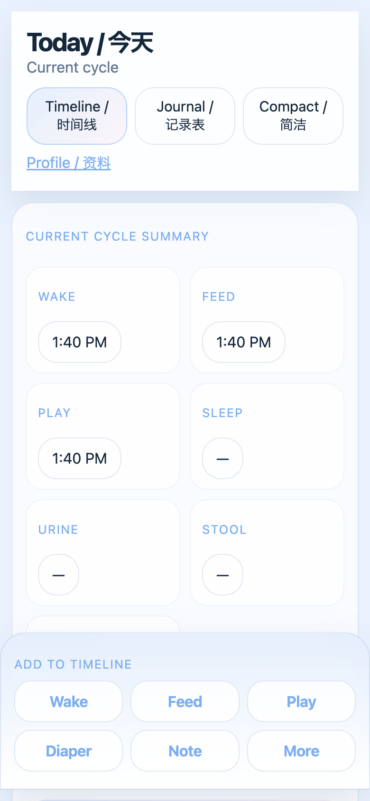
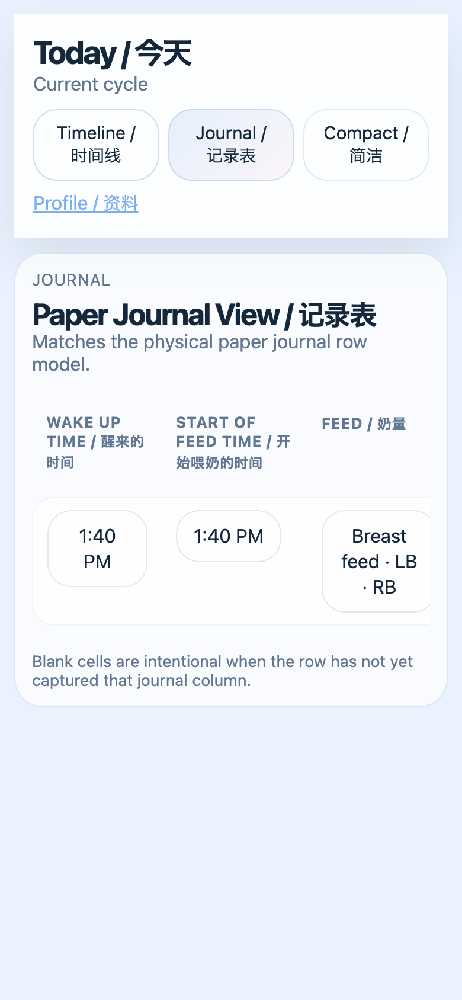
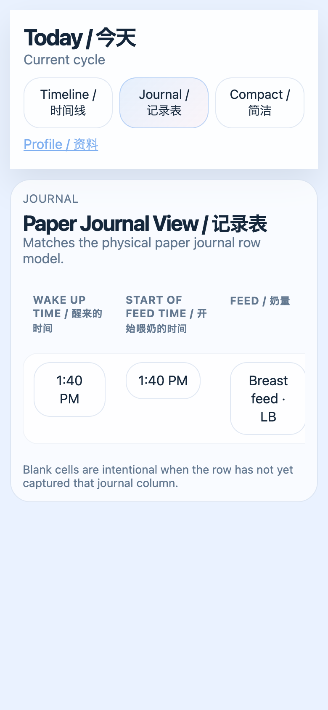

# BabyFlow Today User Guide

Open the same guide inside the app at `Guide / 说明` or `/guide`.

Today is one long working surface. On mobile, you usually do two things:

1. Stay near the top when you are logging quickly.
2. Scroll down when you want to inspect details, corrections, or review panels.

The bottom action dock stays pinned, so you do not need to scroll to the top just to add a Wake, Feed, Play, Diaper, or Note stamp.

## Fast Answer

- Use the top switcher to choose `Timeline`, `Journal`, or `Compact`.
- Use the sticky dock at the bottom to add the next quick action.
- Tap `More` to open the lower details section.
- Scroll down to see `Timeline stamps`, `Intervention attempts`, `State transitions`, and `Feed session details`.
- Tap a timeline item to open the correction sheet.
- Use `Correction history` to restore something you edited or deleted.
- Use `Review / 复盘` when the app flags a cycle as needing checking.
- On a feed card, watch the live timer while the session is open, or tap `Import duration` if you are entering the feed later.

## What The Main Areas Do

| Area | What it is for | What you should do |
|---|---|---|
| `Today / 今天` header | Confirms you are on the Today route | Read this first so you know you are in the main working screen |
| `Timeline / 时间线` | Operational chronology view | Use this when you are logging or reviewing the sequence of events |
| `Journal / 记录表` | Paper-journal style projection | Use this when you want the paper-compatible row layout |
| `Compact / 简洁` | Condensed one-handed view | Use this when you want fewer words and tighter spacing |
| `Profile / 资料` | Baby profile and language settings | Use this when you need to switch or inspect the baby profile |
| `Current cycle summary` | Short top-level row summary | Read this first to understand the current cycle |
| `View row details` / `Hide row details` | Toggle for the lower detail panels | Tap it when you need the deeper logs, then tap again to close them |
| `Live timeline stream` | The actual chronology of items | Tap an item when you want to correct or inspect it |
| `Review / 复盘` | Automatically grouped cycles and review ranges | Check this when the app is asking you to review a cycle |
| `Correction history` | Audit trail of updates, deletes, merges, and restores | Use this when you want to undo or verify a correction |
| `Timeline stamps` | Raw event list | Use this to see the simple stamps you added from the dock |
| `Intervention attempts` | Caregiver attempts like soothe, wait, or wake attempt | Use this when you want to log what you tried |
| `State transitions` | Derived baby-state movement | Use this to understand how the baby changed state over time |
| `Feed session details` | Feed sessions, left/right segments, and feed timers | Use this when you need feed structure, segments, closure, or to import the total duration manually |
| Bottom sticky dock | Quick one-tap logging | Use this for the next Wake, Feed, Play, Diaper, or Note action |

## How To Read The Page

The screen is not a dashboard of separate pages. It is one continuous story surface.

- Stay at the top when you are in a hurry.
- Scroll down when you want the supporting evidence.
- Scroll back up when you want the summary or the quick-action dock.

If you are wondering whether you should scroll down to add details: yes, for review and correction work.  
If you are wondering whether you should scroll up to keep logging: no, the sticky dock stays available.

## Happy Route: Log A Normal Caregiving Sequence

This route is the most common one.

1. Open `Timeline`.
2. Tap `Wake` in the sticky dock.
3. Tap `Feed` in the sticky dock.
4. If needed, tap `Play`, `Diaper`, or `Note`.
5. Tap `More` to open the lower panels.
6. Scroll down and review:
   - `Timeline stamps`
   - `Intervention attempts`
   - `State transitions`
   - `Feed session details`
7. Tap any item in `Live timeline stream` if you want the correction sheet.
8. Switch to `Journal` if you want the paper-style row.
9. Switch to `Compact` if you want the condensed one-handed layout.

Screenshots for this route:

## What The Buttons Mean

### Sticky Dock Buttons

- `Wake` stamps the start of the current awake cycle.
- `Feed` starts a feed session.
- `Play` adds a play stamp.
- `Diaper` adds a diaper stamp.
- `Note` adds a note stamp.
- `More` opens the lower detail panels.

### View Switcher

- `Timeline / 时间线` is the live chronology view.
- `Journal / 记录表` is the paper-journal view.
- `Compact / 简洁` is the condensed view for quick reading.

### Summary Controls

- `View row details` shows the lower logs.
- `Hide row details` hides the lower logs again.
- `Timeline view active.` means you are in the live chronology mode.
- `Compact journal active.` means you are in the condensed mode.

## What The Lower Panels Are For

### Timeline Stamps

This is the raw list of items created from the quick-action dock and related timeline actions.

Use it when you want to confirm:

- what was stamped
- in what order
- at what time

### Intervention Attempts

This section records what the caregiver tried.

Examples:

- `Soothe`
- `Wait`
- `Pat`
- `Sing`
- `Wake attempt`

Use it when you want to capture effort, not just outcomes.

### State Transitions

This section shows the derived baby-state movement.

Examples:

- `CRYING → FEEDING`
- `FEEDING → DROWSY`
- `DROWSY → ASLEEP`

Use it when you want to understand how the baby changed, not just what was stamped.

### Feed Session Details

This section shows feed sessions and their segments.

Use it when you need to see:

- feed start
- left/right latch segments
- feed closure
- live elapsed feed time
- imported feed duration

Feed control is intentionally flexible:

- Tap `Feed` to start a session immediately.
- Watch the live timer while the session is open.
- Tap `Import duration` if you want to enter the total minutes manually.
- Add left/right/bottle segments while the session is active.
- Tap `Close session` when the feed is done.

### Correction History

This section shows updates, deletes, merges, restores, and undo records.

Use it when you need to:

- restore a deleted item
- verify a correction
- see what changed and why

### Review

This section groups related items into a needs checking surface.

If you see `needs checking`, the app is telling you the cycle is ambiguous or incomplete enough to inspect manually.

Screenshots for this route:

## Correction Route: Fix Something You Logged Wrong

1. Open `Timeline`.
2. Tap a card in `Live timeline stream`.
3. The timeline detail sheet opens.
4. Choose one of these actions:
   - `Update time`
   - `Update details`
   - `Delete`
   - `Merge duplicate`
   - `Undo`
5. If you need to explain the correction, pick a reason such as:
   - wrong time
   - accidental tap
   - duplicate
   - late entry
   - paper journal
   - facilitator advice
   - other
6. After saving, check `Correction history`.
7. Confirm the Journal and Compact views match the correction.

## Review Route: When The App Flags A Cycle

1. Open `Review / 复盘`.
2. Read the cycle type and reason.
3. If the sequence looks right, tap the cycle to mark it reviewed.
4. If it looks wrong, inspect the items above it:
   - the live timeline
   - the intervention attempts
   - the state transitions
   - the feed sessions

This route is what you use when the app is asking, “Is this cycle grouped correctly?”

## Scenario Examples From The Tests

### Scenario 1: Happy Route

Use this when you are doing a normal wake/feed/play run.

1. Start on `Timeline`.
2. Tap `Wake`.
3. Tap `Feed`.
4. Tap `Play`.
5. Tap `More`.
6. Scroll down and read the lower panels.
7. Open one timeline item and correct it if needed.

### Scenario 2: Intervention Route

Use this when you want to log what you tried to calm or regulate the baby.

1. Open `More`.
2. Scroll to `What you tried`.
3. Tap `Soothe`, `Wait`, or `Wake attempt`.
4. Check `State transitions` to see whether the attempt changed the baby state.

### Scenario 3: Feed Session Route

Use this when a feed has multiple segments.

1. Tap `Feed` in the sticky dock.
2. Add the session.
3. Add `LEFT` and `RIGHT` segments.
4. If the feed is still open, use the live timer to see how long it has been going.
5. If you are importing a feed afterward, tap `Import duration` and enter the total minutes.
6. Close the session.
7. Scroll down to `Feed session details` and verify the segments and duration.

### Scenario 4: Correction Route

Use this when you need to fix a logged item.

1. Tap a live timeline item.
2. Edit the time or details.
3. If the item is a duplicate, merge it.
4. If the item is wrong, delete it.
5. Use `Correction history` to restore it if needed.

### Scenario 5: Review Route

Use this when the app says `needs checking`.

1. Open `Review / 复盘`.
2. Open the cycle.
3. Compare it against the live timeline, interventions, and feed sessions.
4. Mark it reviewed once it looks right.

## Practical Rule Of Thumb

- If you are logging quickly, stay near the top and use the sticky dock.
- If you are verifying what happened, scroll down.
- If you are correcting history, tap a timeline item.
- If you are reviewing a cycle, inspect `Review / 复盘`.
- If you want the paper-journal layout, switch to `Journal`.
- If you want the smallest one-handed layout, switch to `Compact`.
