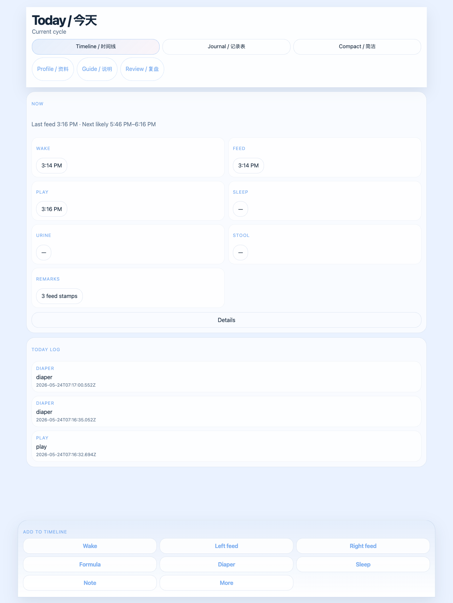
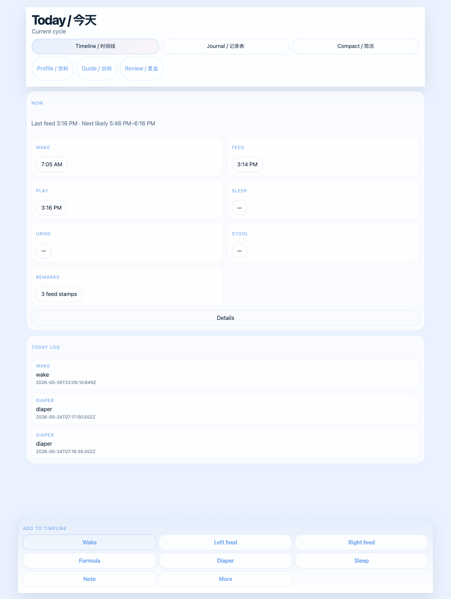
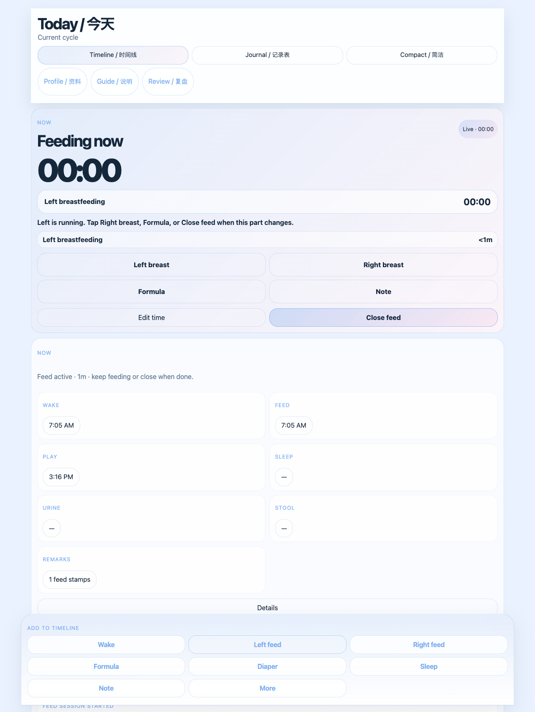
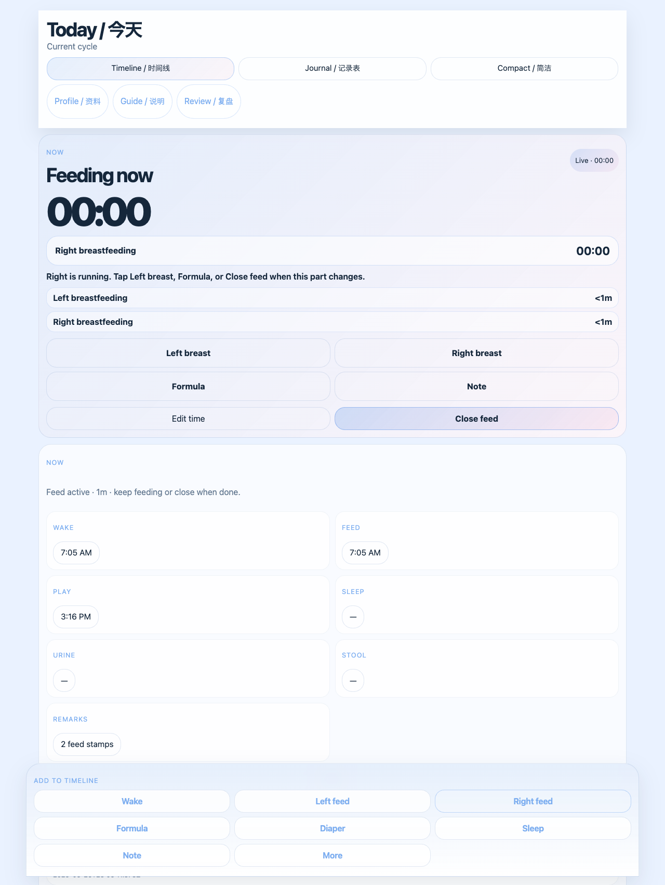
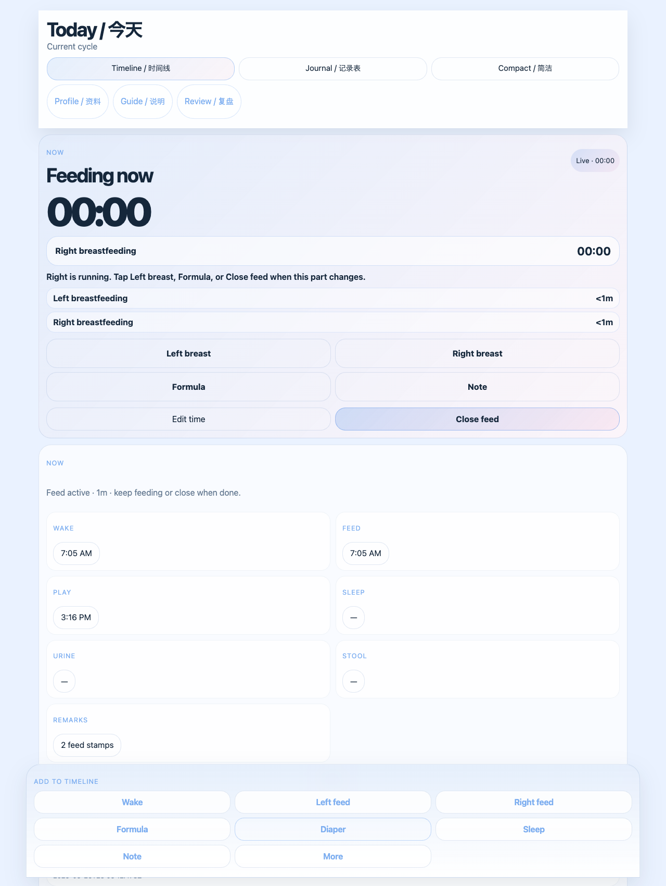
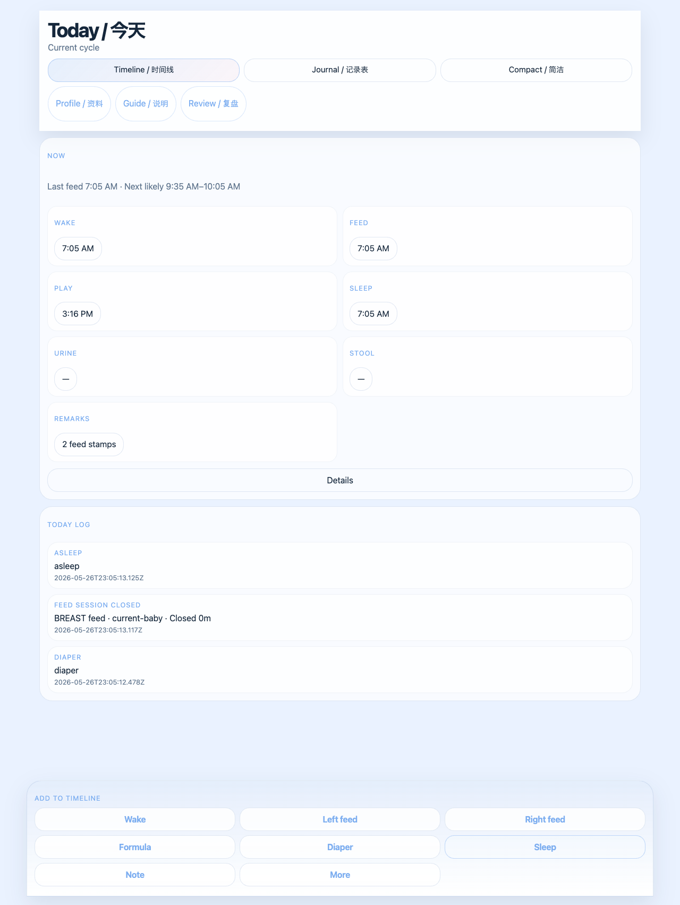
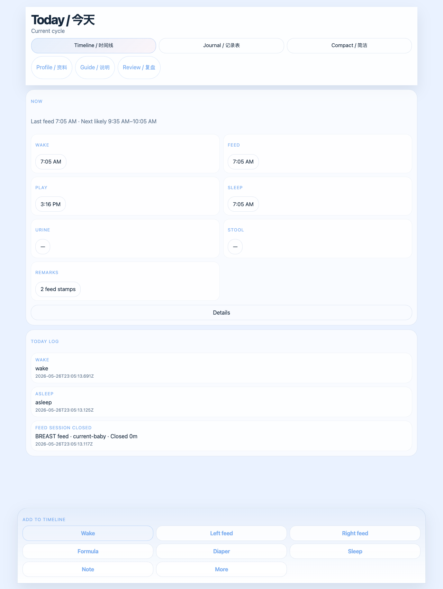
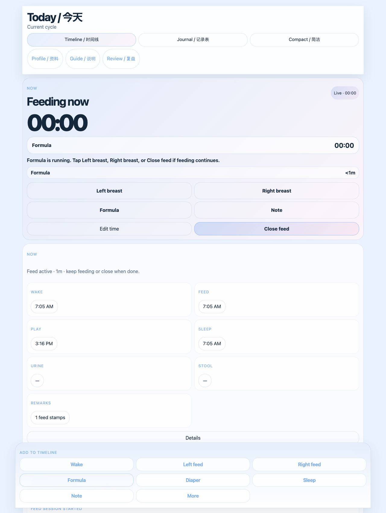
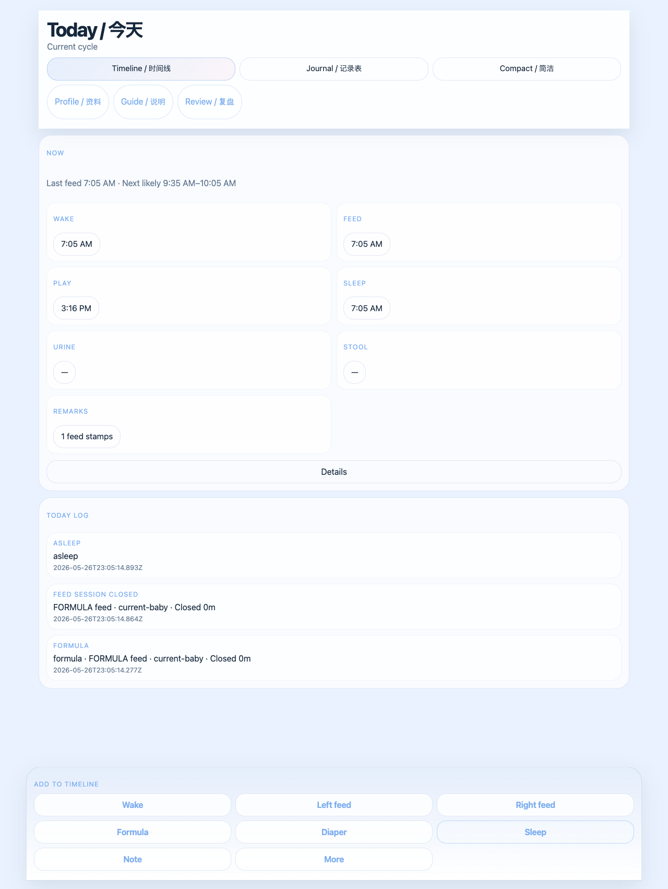

# Two-Cycle Feed, Wake, Sleep Scenario

This scenario shows two real-world cycles in the Today page:

1. Feed, diaper, sleep.
2. Wake again, then formula top-up, then sleep again.

It also shows how the active feed card keeps the current segment running while earlier segments stay visible in the same feed session.

## Scenario Rules

- `Left feed`, `Right feed`, and `Formula` start or switch the active feed segment stopwatch.
- `Sleep` closes the current active feed.
- `Formula` before `Sleep` stays in the same feed session.
- `Formula` after `Sleep` starts a new feed section.

## Step 1: Start on Today

What to look at:

- `Timeline / 时间线` is selected.
- The top summary shows the current cycle.
- The sticky dock is pinned at the bottom.

Button to press next:

- `Wake`

## Step 2: Wake starts cycle 1

What changes:

- A wake stamp is added to the live chronology.
- The top summary now shows the new wake as part of the current cycle.

Important components:

- `Now` summary
- `Today log`
- sticky dock

Button to press next:

- `Left feed`

## Step 3: Left feed starts the active feed

What changes:

- The feed card appears with a running stopwatch.
- `Left breastfeeding` becomes the current segment.
- The feed card shows guidance for the next action.

Important components:

- active feed card
- segment stopwatch
- guidance line
- segment sequence

Button to press next:

- `Right feed`

## Step 4: Right feed switches the current segment

What changes:

- The current segment switches from left to right.
- The earlier left segment stays in the same feed session.
- The segment list preserves the order of the feed.

Important components:

- current segment label
- feed segment sequence
- next-action guidance

Button to press next:

- `Diaper`

## Step 5: Diaper is stamped during the active feed

What changes:

- A diaper stamp is added without closing the feed.
- The feed can continue after the diaper action.

Important components:

- `Diaper` stamp in the timeline
- active feed card remains visible
- segment stopwatch keeps running

Button to press next:

- `Sleep`

## Step 6: Sleep closes cycle 1

What changes:

- `Sleep` closes the active feed.
- The first cycle now ends cleanly.
- The feed card stops being live.

Important components:

- closed feed summary
- timeline stamps for the first cycle
- sticky dock still stays pinned

Button to press next:

- `Wake`

## Step 7: Wake starts cycle 2

What changes:

- A second wake begins a new cycle.
- The page is now ready for a fresh feeding sequence.

Important components:

- live chronology
- `Now` summary
- sticky dock

Button to press next:

- `Formula`

## Step 8: Formula starts a new feed section

What changes:

- Formula starts a new active feed section for cycle 2.
- This is the top-up feed after the second wake.
- The feed card now shows formula as the current segment.

Important components:

- active feed card
- formula segment stopwatch
- feed sequence list

Button to press next:

- `Sleep`

## Step 9: Sleep closes cycle 2

What changes:

- The second cycle ends.
- The formula top-up stays in its own feed section.
- The page returns to a stable logged state.

Important components:

- final chronology for both cycles
- closed feed state
- sticky dock for the next action

## What This Scenario Teaches

- The main page is a working surface, not just a dashboard.
- The sticky dock is how you keep logging without scrolling back up.
- Feed can be split into multiple segments.
- Formula after sleep becomes a new feed section.
- The feed card helps you understand what is running right now.
